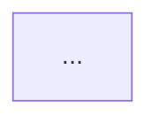

# ドメインモデリング（機能追加）

既存システムへ機能を追加するとき、**業務イベント図**と**ドメインモデル図**を作る。それぞれ**理想案と現実案の2案**を並記し、どちらを採るかの判断はユーザーに委ねる。

## なぜ2案を並記するのか

現行コードは、過去の締切・当時の理解・移行の都合が堆積した結果であって、**あるべき姿とは限らない**。現行モデルだけを起点にすると、既存の歪みをそのまま引き継いだ機能追加になる。かといって現行を無視した案だけでは実装できない。

そこで、**現行実装を一切見ない書き手**と**現行実装を踏まえる書き手**を独立に走らせ、両方の成果物を並べる。2案の差分そのものが「いま何を諦めているか」の可視化になる。

**このスキルは2案を統合しない。** 統合してしまうと、どこで理想を諦めたのかが見えなくなる。判断はユーザーが行う。ただしプロジェクト方針として**理想を重視する**ため、成果物では理想案を先に置く。理想案を必ず採る、という意味ではない。

---

## 出すもの / 出さないもの

| 出す | 出さない |
|---|---|
| 業務イベント図（イベント・コマンド・ポリシー・アクター） | テーブル定義・カラム・マイグレーション |
| ドメインモデル図（集約ルート・エンティティ・値オブジェクト） | Ruby等のクラス・メソッド・ファイル配置 |
| 各図の理想案と現実案 | 現行モデルとの差分表 |
| | ユビキタス言語・用語集（`ubiquitous` スキルの担当） |
| | 境界づけられたコンテキスト（BC）の分割・境界判断 |

**BCは扱わない。** 集約・エンティティ・値オブジェクトという戦術的パターンだけでモデルを組む。新BCが必要か等の戦略的設計は、このスキルの対象外。

現行モデルは**内部利用のみ**。現行モデル図をファイルに出力することはしない。成果物に描くのは常に「機能追加後の状態」。

---

## ワークフロー

途中でユーザーの承認を取るチェックポイントは設けない。Step 1 で不足情報を聞いたら、Step 5 まで一気に進める。

```
1. 入力の整理          要求/要件を受け取り、モデリングに足りない事実だけ質問する
2. 現行モデルの把握     既存コードを自律探索する（内部利用）
3. 業務イベント図       理想/現実の2エージェントを並行実行 → 保存
4. ドメインモデル図     理想/現実の2エージェントを並行実行 → 保存
5. 要約                 2案の分岐点をユーザーに提示する
```

### Step 1: 入力を整理し、足りない事実だけ質問する

入力は**ビジネス要求**（「キャンセル待ちを入れたい」程度の粗い要望）でも、**整理済みの要件**（振る舞いや制約まで書かれたもの）でも受け付ける。

どちらで来ても、**要件の抜けは必ず確認する**。要件の形で渡された場合こそ、書かれていない業務ルールが「書かなくても当然」と省略されている可能性が高い。

ユーザーは**ドメインエキスパート**として扱う。業務の実態・例外運用・暗黙のルールを知っているのはユーザーであって、こちらではない。ここを推測で埋めると、もっともらしいが現場に存在しない業務ルールが混入する。

**質問してよいこと（こちらでは決められない業務の事実）:**
- そのイベントが起きる条件・起きない条件（例: 「キャンセル待ちの繰り上げは自動か、担当者の操作か」）
- 順序・優先順位のルール（例: 「繰り上げは先着順か、会員ランク順か」）
- 数の制約（例: 「1人が同時に何件まで待てるか」）
- 業務上の例外運用（例: 「電話で受けた分を手入力する運用があるか」）
- 時間の扱い（例: 「締切を過ぎた待ちは自動で消えるか」）

**質問しないこと（こちらで判断すべき設計事項）:**
- 集約の切り方、値オブジェクトの置き方 → 理想案/現実案として提示する対象
- 命名 → ドラフトして提示すればよい
- 「理想案と現実案どちらがいいですか」 → 判断材料を並べるのがこのスキルの仕事で、選ばせるのは最後

質問は**Step 1 でまとめて出す**。選択肢を提示できる質問ツール（AskUserQuestion、request_user_input 等）が利用可能ならそれを使う。聞くことがなければ、質問せず Step 2 へ進む。

### Step 2: 現行モデルを把握する

既存コードを自律的に探索し、機能追加が触れる範囲の現行モデルを把握する。ユーザーに探索範囲の確認は取らない。

読み取り専用のサブエージェント機構（Claude Code の `Explore`、Codex の `collaboration.spawn_agent` 等）が利用可能なら委譲する。委譲した場合、メインコンテキストでは直接 Grep/Read しない。

**集めるもの:**
- 機能追加が触れるモデル/テーブルと、その関連（1対多・多対多・ポリモーフィック等）
- 状態を持つ属性（status・enum・各種フラグ・`*_at` 系のタイムスタンプ）
- 業務ルールが書かれている箇所（バリデーション・コールバック・スコープ・状態遷移）
- 現行の呼び名（英語のクラス名・カラム名と、i18n やコメントに現れる日本語名の対応）

ここで得た現行モデルは Step 3・4 の**現実側エージェントにだけ**渡す。理想側には渡さない。

### Step 3: 業務イベント図を作る（理想/現実 並行）

2つのエージェントを**同時に**起動する。両者は対話しない。独立に書いた結果を並べることに意味があるので、途中ですり合わせない。

| | 理想エージェント | 現実エージェント |
|---|---|---|
| 渡す入力 | 要求/要件、Step 1 の回答 | 要求/要件、Step 1 の回答、Step 2 の現行モデル |
| 渡さない入力 | 現行モデル、既存コード | — |
| 立ち位置 | 業務としてどうあるべきかだけで組む | 現行モデルの構造を踏まえ、無理のない範囲で組む |

理想エージェントに現行コードを見せないのは、見せた上で「無視しろ」と指示しても引きずられるため。入力から遮断するのが確実。

指示テンプレートは `references/agent-prompts.md` を参照。記法は `references/event-notation.md`。

書けたら `./tmp/<機能スラッグ>-events.md` に保存する。

### Step 4: ドメインモデル図を作る（理想/現実 並行）

同様に2エージェントを同時起動する。各エージェントには、**Step 3 で同じ立ち位置のエージェントが書いたイベント図**を渡す。理想モデルには理想イベント図、現実モデルには現実イベント図。混ぜると、イベント図とモデル図が食い違った成果物になる。

現実エージェントには Step 2 の現行モデルも渡す。理想エージェントには渡さない。

記法は `references/domain-model-notation.md`。

書けたら `./tmp/<機能スラッグ>-domain-model.md` に保存する。

### Step 5: 要約する

ユーザーに以下を返す。

- 保存した2ファイルのパス
- **理想案と現実案が割れた点**（3〜5個程度）。それぞれ「理想はこう置いた / 現実はこう置いた / 現実側が諦めているのは何か」を1行ずつ
- 2案が一致した点があれば、その旨（判断が要らない箇所だと分かる）
- Step 1 で質問したが回答が得られず、仮置きで進めた箇所（あれば）

割れた点の説明では、優劣の断定を避ける。判断するのはユーザーで、こちらの仕事は**何を天秤にかけているのかを見えるようにすること**。

---

## 機能スラッグとファイル名

依頼内容から機能を表す kebab-case のスラッグを推定する（例: 「予約のキャンセル待ち」→ `waitlist`）。

- `./tmp/<機能スラッグ>-events.md`
- `./tmp/<機能スラッグ>-domain-model.md`

既存ファイルは上書きする。

各ファイルの中で理想案・現実案を並記する（案ごとにファイルを分けない）。理想案を先に置く。

---

## 出力ファイルの構造

### `<機能スラッグ>-events.md`

````markdown
# <機能名> 業務イベント

## 理想案

<この案がどういう業務の姿を前提にしているかを2〜3行>



### ポリシー

| きっかけとなるイベント | 起こすこと | 同期/非同期 |
|---|---|---|
| ... | ... | ... |

## 現実案

<現行モデルのどの構造に合わせたかを2〜3行>


### ポリシー

| きっかけとなるイベント | 起こすこと | 同期/非同期 |
|---|---|---|
| ... | ... | ... |

## 2案の分岐点

| 論点 | 理想案 | 現実案 | 現実案が諦めるもの |
|---|---|---|---|
| ... | ... | ... | ... |
````

### `<機能スラッグ>-domain-model.md`

````markdown
# <機能名> ドメインモデル

## 理想案

<集約をこう切った理由を2〜3行>

```mermaid
classDiagram
    ...
```

## 現実案

<現行モデルのどの構造に合わせたか、それによって何が変わったかを2〜3行>

```mermaid
classDiagram
    ...
```

## 2案の分岐点

| 論点 | 理想案 | 現実案 | 現実案が諦めるもの |
|---|---|---|---|
| ... | ... | ... | ... |
````

---

## 記法リファレンス

- 業務イベント図: `references/event-notation.md` — イベント・コマンド・ポリシー・アクターの定義と flowchart の書き方
- ドメインモデル図: `references/domain-model-notation.md` — ステレオタイプ、値オブジェクトの展開ルール、NG/OK例
- 並行エージェントへの指示: `references/agent-prompts.md` — 理想/現実それぞれのプロンプトテンプレート

---

## エッジケース

- **サブエージェント機構が使えない環境**: `references/agent-prompts.md` の理想側プロンプトを自分に適用して理想案を書き切り、**それを書き終えてから**現行モデルを読んで現実案を書く。順序が逆になると理想案が現行に引きずられる
- **要求が曖昧すぎてイベントが1つも立たない**: Step 1 に戻り、「この機能で最初に起きることは何か」「それは誰の操作で始まるか」を聞く。推測でイベントを捏造しない
- **理想案と現実案がほぼ一致した**: そのまま両方出す。一致は「現行モデルが素直で、無理なく機能追加できる」という有益な情報なので、片方を省略しない
- **機能追加の影響がモデル1つに閉じる小規模な変更**: それでも2案は出す。ただし分岐点が無ければ「分岐点なし」と明記して短く終える
- **既存コードが見つからない（新規プロジェクト等）**: 現実案の前提が成立しないので、その旨を伝えた上で理想案のみを出す
