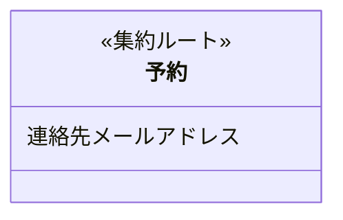
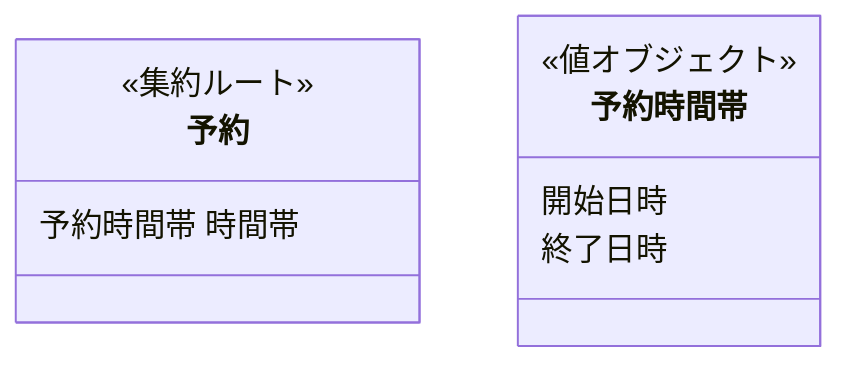
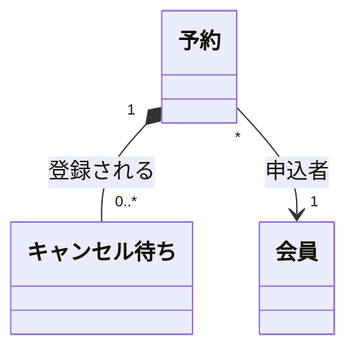
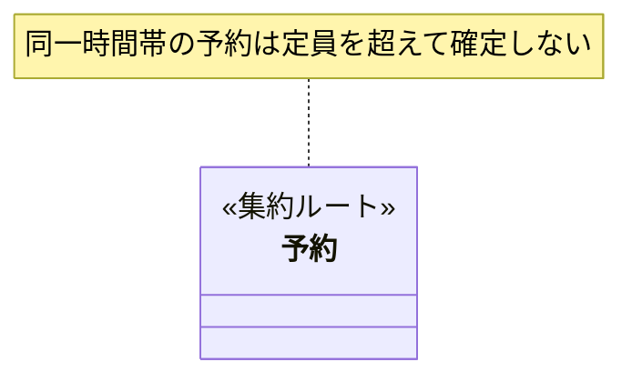
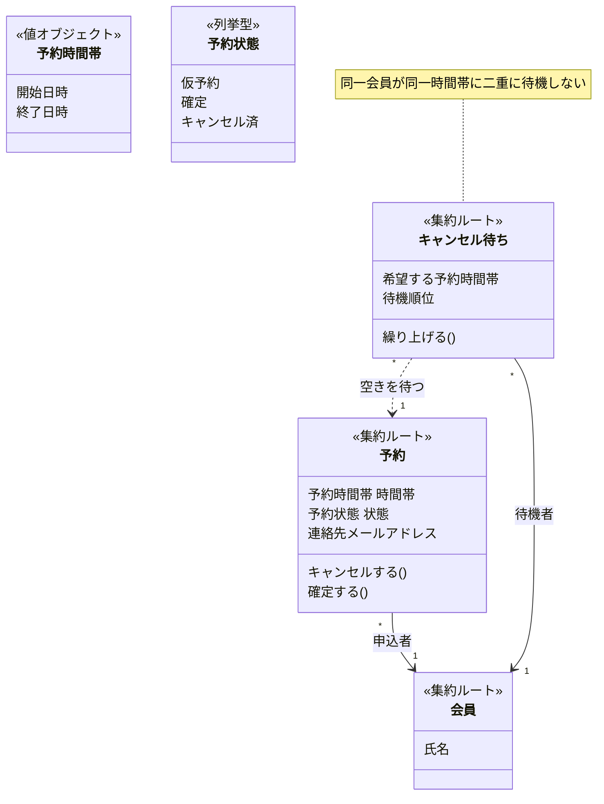

# ドメインモデル図の記法

Mermaid `classDiagram` で、機能追加後のドメインモデルを表す。

## 目次

- [ステレオタイプ](#ステレオタイプ)
- [値オブジェクトの展開ルール](#値オブジェクトの展開ルール)
- [属性の書き方](#属性の書き方)
- [操作の書き方](#操作の書き方)
- [関係線](#関係線)
- [不変条件（任意）](#不変条件任意)
- [扱わないもの](#扱わないもの)
- [完成例](#完成例)
- [チェックリスト](#チェックリスト)

---

## ステレオタイプ

すべてのクラスに、次のいずれかを付ける。付いていないクラスがあると、読み手はそれがライフサイクルを持つのか値なのか判断できない。

| ステレオタイプ | 意味 | 見分け方 |
|---|---|---|
| `<<集約ルート>>` | 整合性を保つ単位の入り口。外部からはここ経由でしか触れない | この単位でまとめて保存・取得されるか |
| `<<エンティティ>>` | IDで識別され、状態が変わる。集約ルートに属する | 属性が全部変わっても「同じもの」と言えるか |
| `<<値オブジェクト>>` | 値そのものが同一性。不変で、単独では存在しない | 変更＝別の値への置き換え、で違和感がないか |
| `<<列挙型>>` | 取りうる値が有限個で固定 | 業務上、値の集合が決まっているか |
| `<<外部システム>>` | 自分たちが設計しない相手（決済代行・外部API等） | 自分たちのモデルとして設計できないもの |

エンティティと値オブジェクトの違いは、属性の中身ではなく**同一性の持ち方**にある。

| | エンティティ | 値オブジェクト |
|---|---|---|
| 同一性 | IDで識別 | 属性の値そのもの |
| ライフサイクル | 独自に生成・変更・削除される | 保持側と運命を共にする |
| 可変性 | 状態が変わる | 不変（変更は置き換え） |

---

## 値オブジェクトの展開ルール

値オブジェクトを機械的に全部クラス化すると、図が小さな箱で埋まって主要な集約構造が読めなくなる。逆に全部インライン展開すると、まとまりを持つべき概念（開始と終了は必ずセット、など）がバラける。属性数で切り分ける。

### 属性が1つの値オブジェクト → 展開して属性行に直接書く

型名として登場させず、値そのものを保持側の属性として書く。

`メールアドレス` という独立クラスは作らない。単一値の値オブジェクトを箱として描いても、図から読み取れる情報が増えないため。

### 属性が2つ以上の値オブジェクト → 別クラスとして定義し、型名で参照する

保持側の属性行には `型名 属性名` の形で書き、値オブジェクト自身は独立したクラスとして定義する。

**この参照には関係線を引かない。** 属性行に型名が書かれていれば所有関係は読み取れるので、線を引くと図が密になるだけになる。関係線はエンティティ間・集約間に使う。

---

## 属性の書き方

**ビジネス用語だけを書く。** プログラミング上の型名は書かない。

| NG | OK |
|---|---|
| `String 氏名` | `氏名` |
| `Integer 定員` | `定員` |
| `uuid id` | （書かない。IDの存在は `<<エンティティ>>` から分かる） |
| `DateTime created_at` | （書かない。監査目的のタイムスタンプは業務概念ではない） |
| `Boolean is_canceled` | （状態として `<<列挙型>>` で表すか、業務イベントの結果として表す） |

`created_at` / `updated_at` / `id` のような、どのテーブルにもある技術的属性は書かない。ドメインモデル図の読み手が知りたいのは業務概念であって、永続化の都合ではない。

値オブジェクトを型名として参照する場合のみ、`予約時間帯 時間帯` のように型名が登場する（前節参照）。

---

## 操作の書き方

集約ルート・エンティティが持つ**業務上の行為**を書く。メソッドシグネチャは書かない。

| NG | OK |
|---|---|
| `cancel!(reason: String)` | `キャンセルする()` |
| `def calculate_fee` | `キャンセル料を算出する()` |
| `save()` `update()` | （書かない。永続化はドメインの関心事ではない） |

操作は必須ではない。集約の責務を示すのに役立つものだけ書けばよく、CRUDを網羅する必要はない。

---

## 関係線

| 記法 | 意味 | 使う場面 |
|---|---|---|
| `*--` | 所有（コンポジション） | 集約ルートが配下のエンティティを持つ。親が消えれば子も消える |
| `-->` | 参照 | 別の集約をIDで参照する。ライフサイクルは独立 |
| `..>` | 依存 | 一時的に使うだけで、保持はしない |

**多重度とラベルを必ず書く。** どちらも無い線は「関係がある」以上の情報を持たず、読み手が推測で埋めることになる。

集約をまたぐ参照は `-->` を使い、`*--` は使わない。集約の外側のライフサイクルまで所有してしまう表現になるため。

---

## 不変条件（任意）

集約の切り方に根拠がある場合、`note for` で書いてよい。**必須ではない。**

書くのは、**なぜこの単位で集約を切ったのかを説明できるとき**に限る。「同一トランザクションで守らなければ業務が壊れるルール」が集約境界の理由になるので、それが言語化できたときだけ書けばよい。ひねり出す必要はない。

---

## 扱わないもの

- **境界づけられたコンテキスト（BC）**: BC分割・コンテキストマップ・関係パターン（準拠者・ACL等）は扱わない。1つのモデルとしてフラットに描く
- **現行モデルとの差分**: 「新規」「変更」などのマーキングはしない。描くのは機能追加後の最終状態のみ
- **ユビキタス言語の表**: 用語集は `ubiquitous` スキルの担当
- **テーブル・カラム・インデックス**: 論理設計は別の観点なので、この図には持ち込まない

---

## 完成例

---

## チェックリスト

図を出す前に確認する。

- [ ] すべてのクラスにステレオタイプが付いているか
- [ ] 属性に型名（String・Integer・uuid 等）が混ざっていないか
- [ ] `id` `created_at` `updated_at` を書いていないか
- [ ] 単一属性の値オブジェクトをクラス化していないか（属性行に展開したか）
- [ ] 2属性以上の値オブジェクトを、型名参照＋別クラス定義で書いたか（関係線を引いていないか）
- [ ] すべての関係線に多重度とラベルがあるか
- [ ] 集約をまたぐ関係に `*--` を使っていないか
- [ ] 業務イベント図に出てきた概念が、モデルに現れているか
