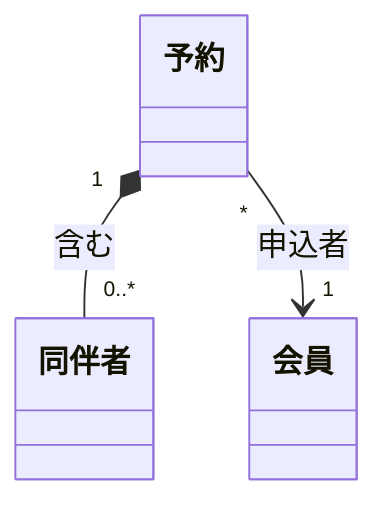
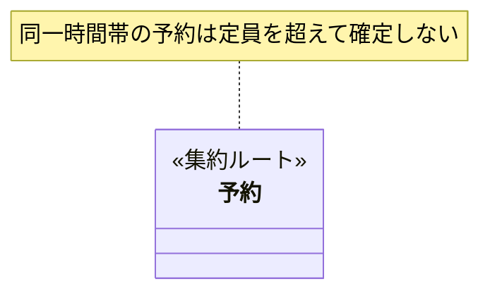
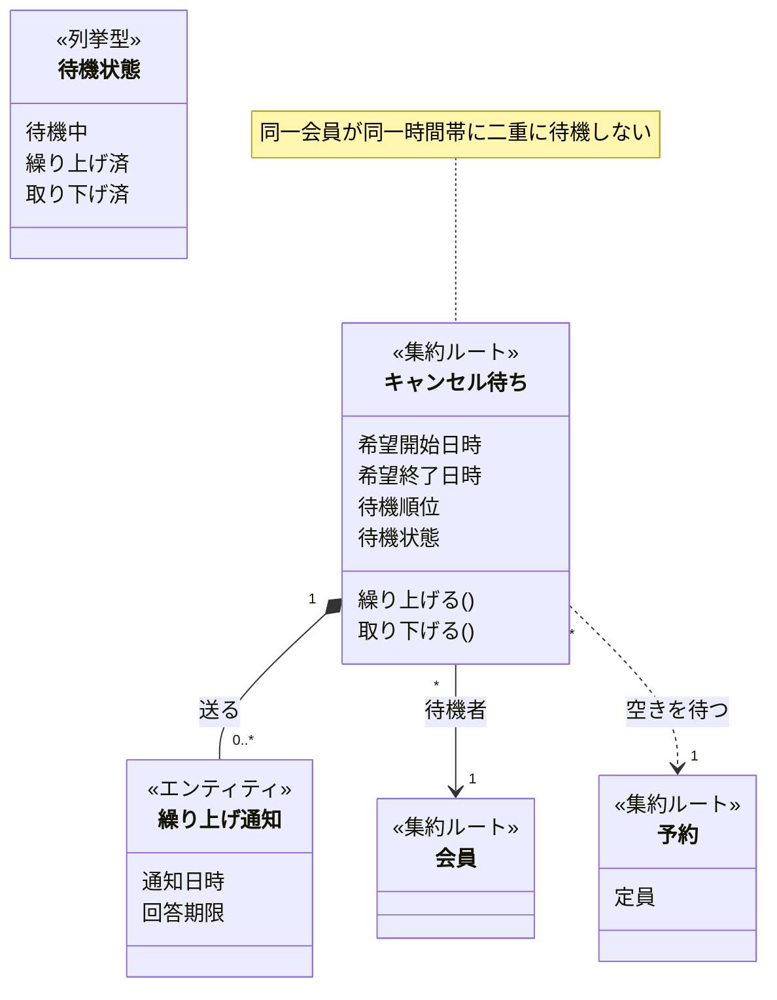

# ドメインモデル図の記法

Mermaid `classDiagram` で、機能追加後のドメインモデルを表す。

## 目次

- [図の主役は新しく登場する概念](#図の主役は新しく登場する概念)
- [ステレオタイプ](#ステレオタイプ)
- [属性の書き方](#属性の書き方)
- [操作の書き方](#操作の書き方)
- [関係線](#関係線)
- [不変条件（任意）](#不変条件任意)
- [扱わないもの](#扱わないもの)
- [完成例](#完成例)
- [チェックリスト](#チェックリスト)

---

## 図の主役は新しく登場する概念

この図を読む人が知りたいのは「**この機能追加で何が増え、それが既存のどこに接続するのか**」であって、既存システムの全体像ではない。既存の概念を調べた分だけ描くと、新概念が既存の海に埋もれて、図の価値がなくなる。

調査は広く、描画は狭くする。現行モデルを広く調べるのは、新概念の置き場所を正しく判断するために必要なので減らさない。減らすのは**描く量**。

### 描く既存概念の範囲

**新概念と直接関係線でつながる既存概念だけを描く。** そこからさらに1つ先（2ホップ目）の既存概念は、調査で見つかっていても描かない。

```
新概念 ──→ 既存概念A     A は描く（直接つながる）
            └──→ 既存概念B   B は描かない（2ホップ目）
```

例外は、2ホップ目を描かないと業務上の意味が通らないとき。その場合だけ描き、なぜ必要かを図の外に1行書く。

### 既存概念に書く属性

既存概念には、**新機能が実際に触れる属性だけ**を書く。触れない属性は、現行モデルに存在していても書かない。

新機能が既存概念の属性を一切触らず、関係線でつながるだけなら、**属性を1つも書かない箱**にする。名前とステレオタイプがあれば「ここに接続する」という情報は伝わる。

新しく登場する概念には、通常どおり属性を書く。

### 分量の目安

**図の中で、新概念の数が既存概念の数を下回ったら描きすぎを疑う。** 機能追加のモデリングで既存概念のほうが多くなるのは、接続点ではなく周辺まで描いている兆候。

---

## ステレオタイプ

すべてのクラスに、次のいずれかを付ける。付いていないクラスがあると、読み手はそれがライフサイクルを持つのか固定値なのか判断できない。

| ステレオタイプ | 意味 | 見分け方 |
|---|---|---|
| `<<集約ルート>>` | 整合性を保つ単位の入り口。外部からはここ経由でしか触れない | この単位でまとめて保存・取得されるか |
| `<<エンティティ>>` | IDで識別され、状態が変わる。集約ルートに属する | 属性が全部変わっても「同じもの」と言えるか |
| `<<列挙型>>` | 取りうる値が有限個で固定 | 業務上、値の集合が決まっているか |
| `<<外部システム>>` | 自分たちが設計しない相手（決済代行・外部API等） | 自分たちのモデルとして設計できないもの |

**値オブジェクトはクラスとして描かない。** 「開始日時と終了日時をまとめて予約時間帯と呼ぶ」といった値のまとまりは、保持側の属性として展開する（次節）。値のまとまりを箱にすると、小さな箱が増えて集約構造が読めなくなるため。

---

## 属性の書き方

**ビジネス用語だけを書く。** プログラミング上の型名は書かない。値のまとまりも、保持側にフラットに展開する。

| NG | OK |
|---|---|
| `String 氏名` | `氏名` |
| `Integer 定員` | `定員` |
| `予約時間帯 時間帯`（値のまとまりを型名で参照） | `開始日時` と `終了日時` を並べて書く |
| `uuid id` | （書かない。IDの存在は `<<エンティティ>>` から分かる） |
| `DateTime created_at` | （書かない。監査目的のタイムスタンプは業務概念ではない） |
| `Boolean is_canceled` | （状態として `<<列挙型>>` で表すか、業務イベントの結果として表す） |

`id` / `created_at` / `updated_at` のような、どのテーブルにもある技術的属性は書かない。この図の読み手が知りたいのは業務概念であって、永続化の都合ではない。

既存概念については、新機能が触れる属性だけを書く（[描く既存概念の範囲](#描く既存概念の範囲)参照）。

---

## 操作の書き方

集約ルート・エンティティが持つ**業務上の行為**を書く。メソッドシグネチャは書かない。

| NG | OK |
|---|---|
| `cancel!(reason: String)` | `キャンセルする()` |
| `def calculate_fee` | `キャンセル料を算出する()` |
| `save()` `update()` | （書かない。永続化はドメインの関心事ではない） |

操作は必須ではない。集約の責務を示すのに役立つものだけ書けばよく、CRUDを網羅する必要はない。既存概念には、新機能が呼び出す操作だけを書く。

---

## 関係線

| 記法 | 意味 | 使う場面 |
|---|---|---|
| `*--` | 所有（コンポジション） | 集約ルートが配下のエンティティを持つ。親が消えれば子も消える |
| `-->` | 参照 | 別の集約をIDで参照する。ライフサイクルは独立 |
| `..>` | 依存 | 一時的に使うだけで、保持はしない |

**多重度とラベルを必ず書く。** どちらも無い線は「関係がある」以上の情報を持たず、読み手が推測で埋めることになる。



集約をまたぐ参照は `-->` を使い、`*--` は使わない。集約の外側のライフサイクルまで所有してしまう表現になるため。

---

## 不変条件（任意）

集約の切り方に根拠がある場合、`note for` で書いてよい。**必須ではない。**



書くのは、**なぜこの単位で集約を切ったのかを説明できるとき**に限る。「同一トランザクションで守らなければ業務が壊れるルール」が集約境界の理由になるので、それが言語化できたときだけ書けばよい。ひねり出す必要はない。

---

## 扱わないもの

- **値オブジェクト**: クラスとして描かない。属性として展開する
- **境界づけられたコンテキスト（BC）**: BC分割・コンテキストマップ・関係パターン（準拠者・ACL等）は扱わない。1つのモデルとしてフラットに描く
- **現行モデルとの差分**: 「新規」「変更」などのマーキングはしない。描くのは機能追加後の最終状態のみ
- **ユビキタス言語の表**: 用語集は `ubiquitous` スキルの担当
- **テーブル・カラム・インデックス**: 論理設計は別の観点なので、この図には持ち込まない

---

## 完成例

キャンセル待ち機能を追加する例。新概念は `キャンセル待ち` と `繰り上げ通知`。`予約` と `会員` は接続先の既存概念なので、新機能が触れる属性だけに絞っている。



`予約` には `定員` だけを書いている（繰り上げ可否の判定に使うため）。`会員` は関係線でつながるだけで属性を触らないので、空の箱にしている。予約が持つ他の属性や、会員に紐づく他の既存概念は描いていない。

---

## チェックリスト

図を出す前に確認する。

- [ ] 新概念の数が既存概念の数以上になっているか（下回るなら既存を描きすぎ）
- [ ] 描いた既存概念はすべて、新概念と直接関係線でつながっているか
- [ ] 既存概念に、新機能が触れない属性を書いていないか
- [ ] 値オブジェクトをクラスとして描いていないか（属性に展開したか）
- [ ] すべてのクラスにステレオタイプが付いているか
- [ ] 属性に型名（String・Integer・uuid 等）が混ざっていないか
- [ ] `id` `created_at` `updated_at` を書いていないか
- [ ] すべての関係線に多重度とラベルがあるか
- [ ] 集約をまたぐ関係に `*--` を使っていないか
- [ ] 業務イベント図に出てきた新しい概念が、モデルに現れているか
