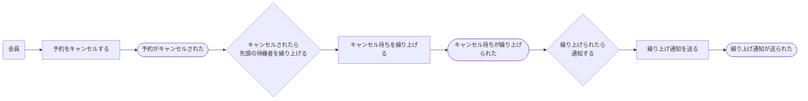

# 業務イベント図の記法

Event Storming の語彙を使って業務の流れを表す。Mermaid `flowchart LR` で描く。

## なぜイベントから始めるのか

いきなり「どんなクラスが要るか」を考えると、既存のテーブル構造や実装しやすさに引きずられる。先に「業務として何が起きるか」を時系列で並べると、そこに現れる名詞が概念の候補になり、**同期的に守らなければならないルール**と**遅れてもよい波及効果**が分離される。この分離が、次のステップで集約を切るときの根拠になる。

---

## 4つの要素

| 要素 | 意味 | 書き方 | 見分け方 |
|---|---|---|---|
| **アクター** | 操作する人・役割・外部の仕組み | 名詞 | 誰が引き金を引くか |
| **コマンド** | やろうとすること（まだ起きていない） | 動詞（現在形）「〜する」 | 失敗しうるか。失敗するならコマンド |
| **イベント** | 起きた事実（もう覆らない） | 動詞（過去形）「〜された」 | 業務の人が「〜されました」と言うか |
| **ポリシー** | 「〜されたら、〜する」という業務ルール | 「〜されたら〜する」 | イベントとコマンドをつなぐもの |

流れは常に **アクター → コマンド → イベント → （ポリシー） → コマンド → イベント → …** の形になる。

コマンドとイベントの区別が曖昧なときは、**失敗しうるかどうか**で判断する。「予約を確定する」は定員超過で失敗しうるのでコマンド。「予約が確定された」は成立した事実なので失敗しようがなく、イベント。

---

## ポリシーの同期/非同期

各ポリシーについて、**きっかけのイベントと同じトランザクションで完了させる必要があるか**を判断し、表に記録する。

判断の問いは「この波及が遅れたとき、業務上まずいことが起きるか」。

| ポリシー | 同期/非同期 | 根拠 |
|---|---|---|
| 予約が確定されたら残枠を減らす | 同期 | 遅れると定員超過の予約を受け付けてしまう |
| 予約が確定されたら確認メールを送る | 非同期 | 数分の遅延は業務上問題にならない |

**同期と判断したポリシーは、次のステップで同じ集約に入る候補になる。** 同一トランザクションで守るべきルールの範囲が、集約の境界になるため。この表はドメインモデル図を書くための入力なので、根拠まで書く。

---

## flowchart の書き方

`flowchart LR` で左から右へ時系列に並べる。要素の種類はノード形状で区別する。

| 要素 | 形状 | 記法 |
|---|---|---|
| アクター | 角丸 | `A1(会員)` |
| コマンド | 四角 | `C1[予約をキャンセルする]` |
| イベント | スタジアム型 | `E1([予約がキャンセルされた])` |
| ポリシー | ひし形 | `P1{キャンセルされたら繰り上げる}` |

**判断が割れた箇所のマーキングはしない。** 理想案と現実案を並べること自体が判断材料の提示になっているので、図の中に注記を足すとノイズになる。

---

## 粒度

- **1つの機能追加につき、イベント10〜20個程度**を目安にする。これを大きく超えるなら、機能の切り出し方が大きすぎる可能性がある
- **異常系は描かない。** バリデーション失敗・権限不足・存在しないデータへの操作は省く。業務の骨格を見るのが目的で、失敗パスを混ぜると本筋が見えなくなる
- **ただし業務上意味のある分岐は描く。** 「定員に空きがあれば即確定、なければキャンセル待ちに回る」のように、どちらも正常な業務の流れとして成立する分岐は両方描く

---

## よくある間違い

| 間違い | なぜ問題か | 直し方 |
|---|---|---|
| イベントを現在形で書く（「予約をキャンセルする」） | コマンドと区別がつかない | 過去形にする（「予約がキャンセルされた」） |
| CRUDをそのままイベントにする（「予約が更新された」） | 業務上何が起きたのか分からない | 業務の言葉にする（「予約時間が変更された」） |
| 画面遷移を並べる | 業務ではなくUIの流れになっている | 「その画面で業務上何が確定するのか」に置き換える |
| ポリシーを飛ばしてイベント同士を直結する | 波及の理由と同期/非同期の判断が失われる | 間にポリシーを置き、同期/非同期を表に書く |
| 技術的な処理をイベントにする（「ジョブがenqueueされた」） | 業務の人が使わない言葉 | 業務上の結果に置き換えるか、削る |
