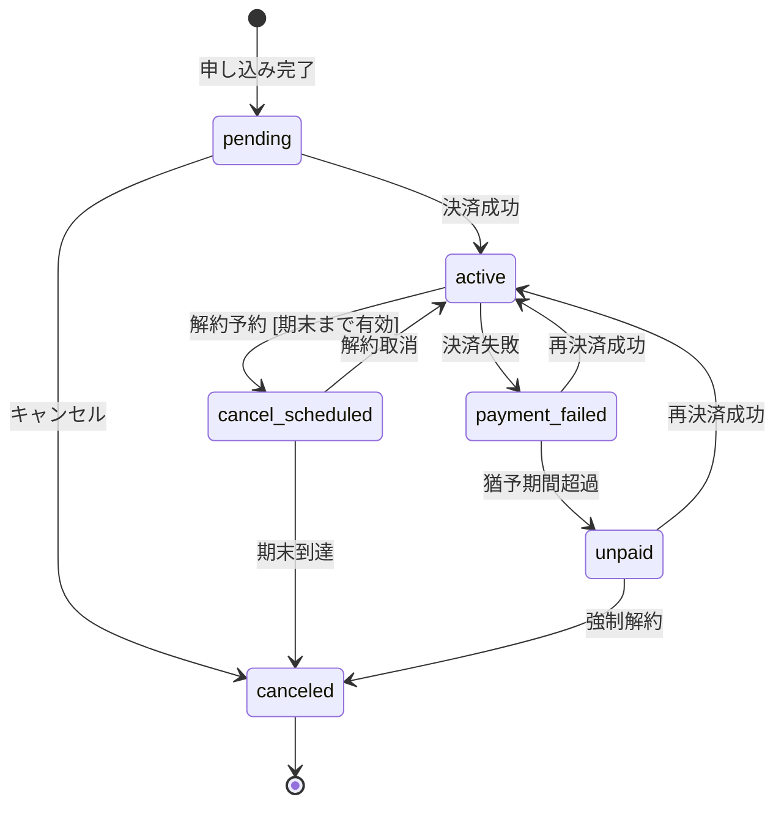

# Rails クラス設計（class-design）

conceptual-modelingスキルの出力を入力として、**Agent Teams**（3人体制）で議論しながら、変更容易性の高いRailsクラス設計を生成する。

---

## 入力と出力

**入力:** conceptual-modelingスキルの出力（必須） + table-designスキルの出力（任意）

conceptual-modelingの出力が提供されていない場合は、ユーザーに先にconceptual-modelingの実行を促す。以下の成果物が揃っていることを確認する：
1. 概念モデル図（Mermaid `classDiagram`）
2. イベントストーミング結果（Mermaid `flowchart LR`）
3. ユビキタス言語（BC別テーブル）
4. BC間連携マトリクス
5. ポリシー整合性分類テーブル
6. 集約分離の判断根拠テーブル（該当する場合）

**出力:**
1. 実装クラス図（Mermaid `classDiagram`）
2. ディレクトリ構成（`app/` ツリー）
3. リードモデル構成テーブル
4. 状態遷移図（Mermaid `stateDiagram-v2`）— 状態を持つ集約のみ
5. 設計判断記録

---

## Agent Teams

設計は3つのペルソナで議論しながら進める。アーキテクチャの理想とRailsの実務の間の緊張関係が、より良い設計判断を生む。

| ペルソナ | 役割 | 発言の特徴 |
|---|---|---|
| **アーキテクト（A）** | レイヤー配置・設計パターン選択・責務分離を判断する。layered-railsの4層ルールを守る | 「この責務はDomain層です」「下位→上位の依存が生まれています」「Formオブジェクトで複数モデルの更新を束ねましょう」 |
| **Railsエンジニア（RE）** | Rails規約・ActiveRecordパターン・実装の実現可能性を検証する。過剰な抽象化を防ぐ | 「Rails規約ではconcernで十分です」「composed_ofよりData.defineが適切です」「モデルメソッドで済みます」 |
| **レビュアー（R）** | 変更容易性・テスト容易性・複雑さを検証する。過剰設計と過少設計の両方を指摘する | 「この設計は要件変更時にどこが壊れますか？」「ここはシンプルなenumで十分では？」「このクラスは責務が多すぎます」 |

**議論の進め方:**
- 各ステップでRE → A → R の順に意見を述べる（実装の現実 → 設計の理想 → 変更容易性の検証）
- 意見が割れた場合はレビュアーがトレードオフを整理し、判断を「設計判断記録」に残す
- **少なくとも1つの設計判断でAとREが異なる見解を持ち、トレードオフを明示した上で判断を下す場面を含めること**
- 全員が合意したら次のステップに進む

---

## ワークフロー

```
1. 入力の検証          conceptual-modeling出力が揃っているか確認
2. マッピング方針の決定  DDD概念→Rails実装パターンの方針を3人で議論
3. クラス図の作成       Mermaid classDiagramで実装クラスを設計
4. リードモデル構成     構成元・フィールド・実装形態を決定
5. 状態遷移図の作成     stateDiagram-v2で状態機械を設計
6. table-designとの整合性確認（入力がある場合）
7. 成果物の保存         Markdownファイルとして保存
```

---

## Step 1: 入力の検証

conceptual-modelingの出力が揃っているか確認する。不足がある場合はユーザーに先にconceptual-modelingの実行を促す。

**確認項目:**
- 概念モデル図に `<<集約ルート>>` が含まれているか
- ESに集約・コマンド・ドメインイベント・ポリシーが含まれているか
- ポリシー整合性分類テーブルがあるか（ポリシー実装の判断に必要）
- ユビキタス言語がBC別に定義されているか

table-designの出力がある場合は、テーブル構造も読み込む。

---

## Step 2: マッピング方針の決定

3人チームで、DDD概念からRails実装パターンへのマッピング方針を議論する。

詳細は `references/ddd-to-rails-mapping.md` を参照。

**議論すべきポイント:**

1. **値オブジェクトの実装方式** — `Data.define` / `composed_of` / `store_model` のどれか（永続化要否で判断）
2. **列挙型の実装方式** — Rails `enum` / `state_machines` gem（遷移ルールの複雑さで判断）
3. **コマンドの配置** — モデルメソッド / Formオブジェクト（集約の数・外部連携の有無で判断。Serviceクラスは作成しない）
4. **ポリシーの実装** — モデルメソッド / ActiveJob + EventHandler（整合性分類テーブルに基づく）
5. **リードモデルの実装** — Query object / DB view / scope（複雑さで判断）
6. **BC間連携の実装** — BC連携マトリクスの連携パターンに基づく

各判断の根拠を「設計判断記録」に残す。

---

## Step 3: クラス図を作成する

Step 2の方針に基づき、Mermaid `classDiagram` で実装クラスを設計する。

詳細は `references/class-diagram-guide.md` を参照。

**実装クラス図のルール:**
- ステレオタイプは実装パターンを使う: `<<ActiveRecord>>` `<<Query>>` `<<ValueObject>>` `<<Form>>` `<<Policy>>` `<<Concern>>` `<<EventHandler>>` `<<Gateway>>` `<<Enum>>`
- **Serviceクラスは作成しない。** ドメインロジックはモデルメソッドに、複数モデルにまたがる操作はFormオブジェクトまたはモデルメソッド内で処理する
- クラス名はRailsクラス名（英語）。namespace は `_` で区切る（例: `Billing_Subscription`）
- フィールドは型付き（例: `status: String`）。FKは書かない（関係線で表現）
- メソッドはpublicインターフェースのみ（シグネチャ付き）
- `note for` で不変条件を記載
- 関係線にラベル（association名）と多重度を記載
- `namespace` ブロックでBC境界を表現

**概念モデル図との対応確認（Step 3の末尾で実施）:**
- 概念モデルの全 `<<集約ルート>>` が `<<ActiveRecord>>` として存在するか
- 概念モデルの全 `<<値オブジェクト>>` が適切なステレオタイプで存在するか
- 概念モデルの全 `<<外部システム>>` が `<<Gateway>>` として存在するか
- ESの全コマンドがモデルメソッド / Formオブジェクトとして配置されているか
- ESの全ポリシーが実装クラスとして配置されているか

---

## Step 4: リードモデル構成を設計する

ESのリードモデルに対して、構成元と実装形態を決定する。

```
| リードモデル名 | 構成元集約 | 主要フィールド | 実装形態 | BC跨ぎ |
|---|---|---|---|---|
| サブスクリプション一覧 | Subscription, Plan | ステータス, プラン名, 金額 | Query object | なし |
| コーチダッシュボード | Coach, Subscription, Session | 契約状況, セッション数 | Query object | あり（Coach BC → Billing BC） |
```

**実装形態の選択基準:**

| 実装形態 | 適用場面 |
|---|---|
| scope | 単一モデルの単純な絞り込み |
| Query object | 複数モデルの結合・複雑なフィルタリング |
| DB view + model | パフォーマンスが重要・頻繁にアクセスされる |

---

## Step 5: 状態遷移図を作成する

概念モデルの `<<列挙型>>` のうち、状態遷移を持つものについて Mermaid `stateDiagram-v2` を作成する。

**含める情報:**
- 全状態（ESのドメインイベントから導出）
- 遷移（コマンド名をトリガーとして記載）
- ガード条件（不変条件から導出）
- 初期状態・終了状態



**整合性チェック:**
- ESのドメインイベントが状態遷移のトリガーとして網羅されているか
- 概念モデルの不変条件がガード条件として反映されているか
- 到達不能な状態がないか

---

## Step 6: table-designとの整合性確認

table-designの出力がある場合のみ実施する。

**確認項目:**
- ActiveRecord model がテーブルと1:1で対応しているか
- `has_many` / `belongs_to` がFK構造と一致しているか
- 値オブジェクトの実装方式がテーブル設計と整合しているか（`composed_of` → 複数カラム、`store_model` → JSON型カラム）
- STI / ポリモーフィック関連の使用がテーブル設計と一致しているか
- 状態遷移図の状態値がenumカラムの値と一致しているか

**不整合がある場合:**
- class-design側の変更で解決できるか検討
- テーブル設計側の変更が必要な場合は「table-designへのフィードバック」として記録

---

## Step 7: 成果物を保存する

すべての成果物は **Markdown ファイルとして保存**する。

**保存先:**
- `docs/ddd/[機能名]-class-design.md`（全成果物を1ファイルにまとめる）

保存後、ファイルパスをユーザーに伝える。

---

## 参考リファレンス

- **DDD→Railsマッピングガイド**: `references/ddd-to-rails-mapping.md` — DDD概念からRails実装パターンへの詳細なマッピングルール・判断フロー・実装例
- **実装クラス図ガイド**: `references/class-diagram-guide.md` — 実装レベルのclassDiagramの書き方・ステレオタイプ・テンプレート・チェックリスト
- **Railsコーディング原則**: `.claude/rules/rails-principles.md` — リッチドメインモデル推奨、Fat Model回避、ConcernよりPORO委譲、**サービスオブジェクト非推奨**。class-designの全判断でこの原則に従う
- **開発原則**: `.claude/rules/development-principles.md` — 変更容易性（ETC原則）、戦略的プログラミング、命名原則（Whyベースでビジネス用語優先）、SRP、Tell Don't Ask、継承より集約
- **layered-railsスキル**: レイヤー配置の判断に使用。4層アーキテクチャ（Presentation → Application → Domain → Infrastructure）のルールとパターンカタログを参照
