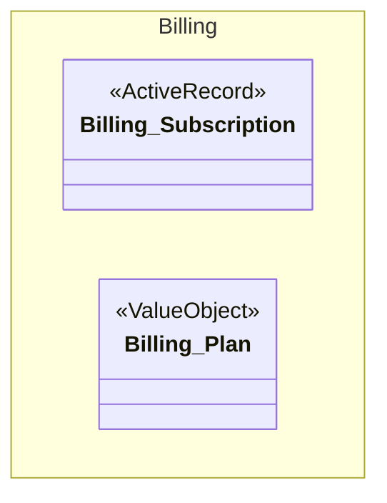

# Rails実装クラス図ガイド

## このドキュメントの目的

conceptual-modelingスキルが出力する概念モデル図（ビジネス用語ベース）を、Rails実装レベルのクラス図に変換するためのガイド。

---

## 概念モデル図との違い

| | 概念モデル図（conceptual-modeling） | 実装クラス図（class-design） |
|---|---|---|
| 目的 | ビジネス概念と関係の整理 | Rails実装の設計 |
| 対象読者 | エンジニア・ビジネス両方 | エンジニアのみ |
| クラス名 | ビジネス用語（日本語） | Railsクラス名（英語） |
| フィールド | 概念的な属性 | 型付きの属性（`status: String`） |
| 操作 | ビジネス上の行為（日本語） | メソッドシグネチャ（`cancel!(): void`） |
| ステレオタイプ | `<<集約ルート>>` `<<値オブジェクト>>` 等 | `<<ActiveRecord>>` `<<Service>>` 等 |
| 関係線 | 概念的な関係 | Rails association（`has_many`, `belongs_to`） |
| namespace | なし | `module Billing::` 等 |

---

## ステレオタイプ

| ステレオタイプ | 意味 | Railsでの実体 | 配置層 |
|---|---|---|---|
| `<<ActiveRecord>>` | ActiveRecordモデル（集約ルート/エンティティ） | `< ApplicationRecord` | Domain |
| `<<Form>>` | フォームオブジェクト（複数モデルの更新） | `include ActiveModel::Model` | Application |
| `<<Query>>` | リードモデルの実装 | Plain Ruby class | Application |
| `<<ValueObject>>` | 値オブジェクト | `Data.define` / `composed_of` | Domain |
| `<<Policy>>` | 認可ポリシー | Plain Ruby class / action_policy | Domain |
| `<<Concern>>` | 共通振る舞い | `ActiveSupport::Concern` | Domain |
| `<<EventHandler>>` | イベントハンドラ / Job | `< ApplicationJob` | Infrastructure |
| `<<Gateway>>` | 外部システムとの接続 | Plain Ruby class | Infrastructure |
| `<<Enum>>` | 列挙型（状態等） | `enum :field` / state_machines | Domain |

---

## 書き方のルール

### 1. クラス名

Railsのクラス名（英語）を使用する。namespaceはクラス名に含める。

```
class Billing_Subscription {
  <<ActiveRecord>>
}
```

**注意:** Mermaidの`classDiagram`ではnamespace区切りに`_`を使う（`::`は使えない）。ドキュメント内で`Billing_Subscription` = `Billing::Subscription`であることを明記する。

### 2. フィールド

型付きで記述する。Rails の型名を使用する。

```
class Billing_Subscription {
  <<ActiveRecord>>
  status: String
  anchor_date: Date
  canceled_at: DateTime?
}
```

- `?` は nullable を表す
- 関連のFK（`plan_id` 等）は書かない（関係線で表現する）

### 3. メソッド

publicメソッドのシグネチャを記述する。戻り値の型も含める。

```
class Billing_Subscription {
  <<ActiveRecord>>
  +cancel!(): void
  +active?(): Boolean
  +change_plan(new_plan: Plan): void
}
```

- `+` は public
- `#` は protected
- `-` は private（原則書かない）

### 4. 関係線

Rails の association を関係線で表現する。

| Rails association | Mermaid記法 | 例 |
|---|---|---|
| `has_many :items, dependent: :destroy` | `A "1" *-- "*" B` | コンポジション（所有） |
| `has_one :profile, dependent: :destroy` | `A "1" *-- "1" B` | コンポジション（所有） |
| `has_many :orders` | `A "1" --> "*" B` | 関連（参照） |
| `belongs_to :plan` | 逆方向で表現 | — |
| 依存（DI等） | `A ..> B` | Service → Gateway |

**ラベル:** association名を記載する（`has_many :items` → `: items`）

**多重度は必ず記載する。**

### 5. namespace の表現

BC境界に対応する namespace は、Mermaid の `namespace` ブロックで表現する。



### 6. Form / Query / Gateway の依存関係

Form や Query はコンストラクタの依存を `..>` で表現する。モデルからGatewayへの依存も同様。

```
Billing_SubscriptionForm ..> Billing_Subscription : creates
Billing_Subscription ..> Billing_PaymentGateway : uses
```

---

## テンプレート

```mermaid
classDiagram

  namespace BC名 {
    class BC名_集約ルート名 {
      <<ActiveRecord>>
      属性1: 型
      属性2: 型
      ---
      +操作1(引数: 型): 戻り値
      +操作2(): 戻り値
    }

    class BC名_エンティティ名 {
      <<ActiveRecord>>
      属性1: 型
    }

    class BC名_値オブジェクト名 {
      <<ValueObject>>
      属性1: 型
      属性2: 型
    }

    class BC名_ステータス {
      <<Enum>>
      状態1
      状態2
      状態3
    }

    class BC名_フォーム名 {
      <<Form>>
      +save(): Boolean
    }

    class BC名_クエリ名 {
      <<Query>>
      +call(): ActiveRecord_Relation
    }

    class BC名_ゲートウェイ名 {
      <<Gateway>>
      +操作(引数: 型): 戻り値
    }
  }

  note for BC名_集約ルート名 "不変条件\n・ルール1\n・ルール2"

  BC名_集約ルート名 "1" *-- "*" BC名_エンティティ名 : items
  BC名_集約ルート名 "1" *-- "1" BC名_値オブジェクト名 : plan
  BC名_集約ルート名 "1" --> "1" BC名_ステータス : status
  BC名_フォーム名 ..> BC名_集約ルート名 : creates
  BC名_集約ルート名 ..> BC名_ゲートウェイ名 : uses
```



---

## サンプル: サブスクリプション機能の実装クラス図

```mermaid
classDiagram

  namespace Billing {
    class Billing_Subscription {
      <<ActiveRecord>>
      status: String
      anchor_date: Date
      canceled_at: DateTime?
      ---
      +activate!(payment_id: String): void
      +cancel!(): void
      +change_plan!(new_plan: Plan): void
      +active?(): Boolean
      +cancelable?(): Boolean
    }

    class Billing_Plan {
      <<ValueObject>>
      name: String
      amount: Integer
      cycle: String
      ---
      +higher_than?(other: Plan): Boolean
    }

    class Billing_SubscriptionStatus {
      <<Enum>>
      pending
      active
      cancel_scheduled
      payment_failed
      unpaid
      canceled
    }

    class Billing_SubscriptionForm {
      <<Form>>
      +save(): Boolean
    }

    class Billing_SubscriptionDashboardQuery {
      <<Query>>
      +call(): ActiveRecord_Relation
    }

    class Billing_PaymentGateway {
      <<Gateway>>
      +charge(amount: Integer, currency: String): PaymentResult
      +refund(payment_id: String): void
      +schedule(subscription_id: String, interval: String): void
    }
  }

  class Billing_HandlePaymentWebhookJob {
    <<EventHandler>>
    +perform(payload: Hash): void
  }

  note for Billing_Subscription "不変条件\n・有料機能は active/cancel_scheduled のみ\n・決済失敗 → 即時機能停止\n・解約は期末のみ\n・カード番号は持たない"

  Billing_Subscription "1" *-- "1" Billing_Plan : plan
  Billing_Subscription "1" --> "1" Billing_SubscriptionStatus : status
  Billing_SubscriptionForm ..> Billing_Subscription : creates
  Billing_Subscription ..> Billing_PaymentGateway : uses
  Billing_SubscriptionDashboardQuery ..> Billing_Subscription : queries
  Billing_HandlePaymentWebhookJob ..> Billing_Subscription : updates
```



---

## 概念モデル → 実装クラス図の変換手順

### Step 1: 集約ルート・エンティティを ActiveRecord に変換

概念モデルの `<<集約ルート>>` `<<エンティティ>>` を `<<ActiveRecord>>` に変換する。

- クラス名をRubyクラス名（英語）に変換
- ビジネス用語の属性をカラム名（英語 + 型）に変換
- ビジネス上の行為をメソッドシグネチャに変換
- namespace を追加

### Step 2: 値オブジェクトの実装を決定

概念モデルの `<<値オブジェクト>>` に対して、`references/ddd-to-rails-mapping.md` の判断フローに従い実装方式を選択する。

### Step 3: コマンド → モデルメソッド / Formオブジェクトを配置

ESのコマンドを `references/ddd-to-rails-mapping.md` の判断フローに従い配置する。Serviceクラスは作成しない。

### Step 4: ポリシー → EventHandler / モデルメソッドを配置

ポリシー整合性分類テーブルに基づいて配置する。

### Step 5: リードモデル → Query を配置

リードモデルを Query object として配置する。

### Step 6: 外部システム → Gateway を配置

`<<外部システム>>` を `<<Gateway>>` として Infrastructure 層に配置する。

### Step 7: 関係線の変換

概念モデルの関係線をRails associationに変換する:

| 概念モデル | 実装クラス図 |
|---|---|
| `A "1" *-- "*" B : 持つ` | `A "1" *-- "*" B : items`（has_many :items, dependent: :destroy） |
| `A "1" --> "0..1" B : 参照` | `A "1" --> "0..1" B : profile`（has_one / belongs_to） |
| `A ..> B : 依存` | `A ..> B : uses`（DI / メソッド引数） |

### Step 8: 整合性チェック

- [ ] 概念モデルの全クラスが実装クラス図に反映されている
- [ ] ESの全コマンドがモデルメソッド/Formオブジェクトとして配置されている（Serviceクラス不使用）
- [ ] ESの全ポリシーが整合性分類に基づいて実装されている
- [ ] ESの全リードモデルがQuery objectとして配置されている
- [ ] 全関係線にラベルと多重度がある
- [ ] namespace がBC境界と一致している
- [ ] layered-railsの4層ルールに違反していない（下位→上位の依存がない）
- [ ] `note for` で不変条件が主要なActiveRecordモデルに記載されている

---

## よくある間違い

### NG: 概念モデルのまま書く

```
class サブスクリプション {
  <<集約ルート>>
  ステータス
  解約を予約する
}
```

### OK: 実装レベルで書く

```
class Billing_Subscription {
  <<ActiveRecord>>
  status: String
  +schedule_cancellation!(): void
}
```

### NG: FKをフィールドに書く

```
class Billing_Subscription {
  <<ActiveRecord>>
  plan_id: Integer    ← NG
  coach_id: Integer   ← NG
}
```

### OK: 関係線で表現する

```
Billing_Subscription "1" *-- "1" Billing_Plan : plan
Coach "1" --> "*" Billing_Subscription : subscriptions
```

### NG: private メソッドを列挙する

```
class Billing_Subscription {
  -validate_status_transition(): void  ← NG
  -calculate_end_date(): Date          ← NG
}
```

### OK: publicインターフェースのみ

```
class Billing_Subscription {
  +cancel!(): void
  +active?(): Boolean
}
```
