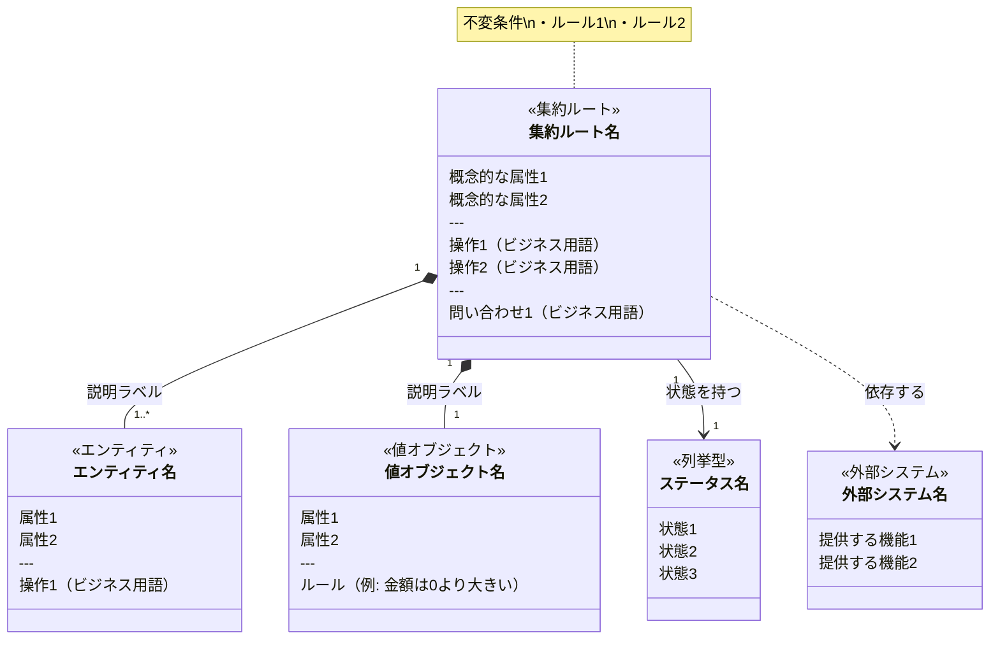
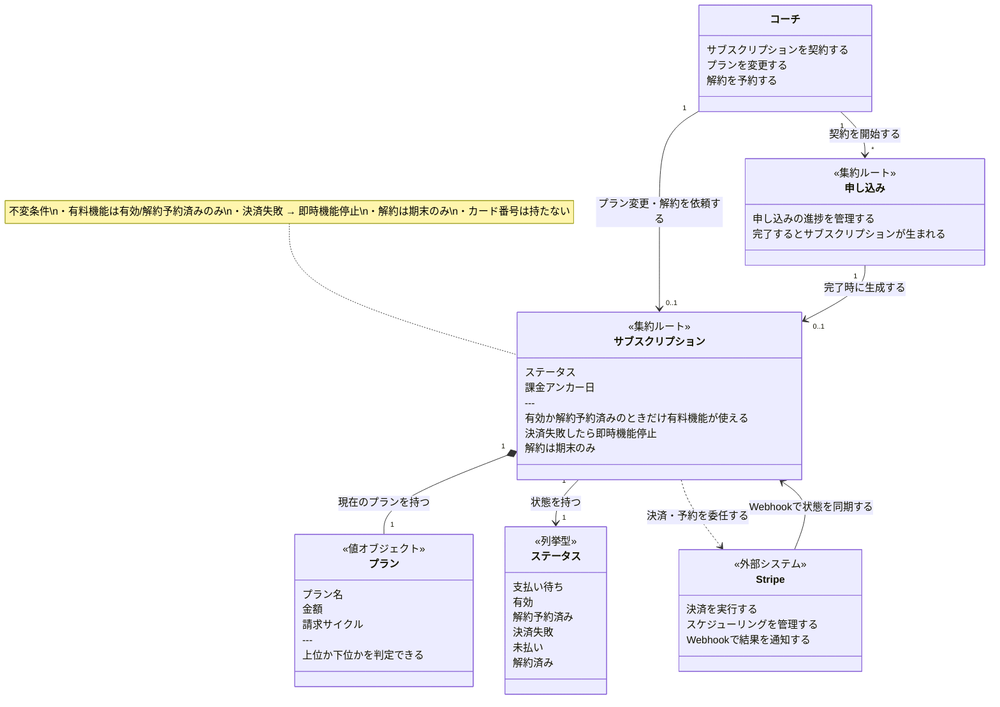

# DDDドメインモデル（概念図）ガイド

## このドキュメントの目的

チームの誰が書いても同じ基準でドメインモデル（概念図）を描けるようにするためのガイド。

---

## ドメインモデル（概念図）とは

ビジネスの問題領域にある「概念」とその「関係性」を図にしたもの。

**ポイントは2つ：**

1. **実装に依存しない** — Ruby・Java・Pythonどの言語で書いても内容は同じになる
2. **ビジネスの言葉で書く** — エンジニアでない人が読んでも理解できる

クラス図（実装のクラス構造）とは異なる。

| | ドメインモデル（概念図） | クラス図 |
|---|---|---|
| 目的 | 概念と関係性の整理 | 実装の設計 |
| 対象読者 | エンジニア・ビジネス両方 | エンジニアのみ |
| 書く言葉 | ビジネス用語 | 型名・メソッド名 |
| 書くタイミング | 集約設計フェーズ | クラス設計フェーズ |
| 依存 | 言語・FWに依存しない | Ruby / Rails などに依存する |

---

## 書き方のルール

### 1. 登場させる要素

| 要素 | 書くもの | 書かないもの |
|---|---|---|
| **クラス名** | ビジネス用語（例: サブスクリプション） | 実装クラス名（例: SubscriptionRecord） |
| **フィールド** | 概念的な属性（例: ステータス、プラン） | 型名（例: `String`、`uuid`） |
| **操作** | ビジネス上の行為（例: 解約を予約する） | メソッドシグネチャ（例: `cancel!(reason:)`） |
| **ルール** | 不変条件（例: 決済失敗→即時機能停止） | 実装の詳細（例: `ensure_status!(:active)`） |
| **関係** | 概念的な関係（例: プランを持つ） | DBの外部キー（例: `plan_id FK`） |

### 2. ステレオタイプ（`<<>>`）

mermaid の `classDiagram` では `<<>>` でステレオタイプを付与する。

| ステレオタイプ | 意味 | 使う場面 |
|---|---|---|
| `<<集約ルート>>` | 集約の入口。外部からはここを通じてのみ操作する | 集約の中心となるクラス |
| `<<エンティティ>>` | 独自の同一性とライフサイクルを持つ概念 | 配送予定、明細行など |
| `<<値オブジェクト>>` | 同一性を持たない不変の概念 | プラン、金額、日付など |
| `<<列挙型>>` | 決まった値の集合 | ステータス、サイクルなど |
| `<<外部システム>>` | 自システムの外にある依存先 | Stripe、メールサービスなど |

**エンティティと値オブジェクトの判断基準:**

| | エンティティ | 値オブジェクト |
|---|---|---|
| 同一性 | 持つ（個体を区別する必要がある） | 持たない（値が同じなら同じ） |
| ライフサイクル | 持つ（作成・変更・削除される） | 持たない（不変、置換で更新） |
| テーブル設計への影響 | 別テーブルになる | カラムとして埋め込み or 参照テーブル |
| 例 | 配送予定（予定→スキップ→注文生成と状態変化） | プラン（名前・金額の組で不変） |

### 3. 関係線の種類

| 記法 | 意味 | 使う場面 |
|---|---|---|
| `A "1" *-- "*" B` | AはBを所有する（コンポジション） | 集約ルートがエンティティ・値オブジェクトを持つ |
| `A "1" --> "0..1" B` | AはBを参照する（関連） | 状態として列挙型を参照する |
| `A ..> B` | AはBを使う（依存） | 外部システムへの依存 |

**多重度は必ず記載する。** テーブル設計で外部キーの配置や中間テーブルの要否を決める重要な情報。

| 記法 | 意味 |
|---|---|
| `"1"` | ちょうど1つ |
| `"0..1"` | 0または1つ |
| `"*"` | 0以上（複数） |
| `"1..*"` | 1以上（複数） |

### 4. 不変条件の書き方

`note for クラス名` でビジネスルールを明記する。

```
note for サブスクリプション "不変条件\n・決済失敗 → 即時機能停止\n・解約は期末のみ"
```

### 5. 書いてはいけないもの

以下は概念図には不要。クラス図に書く。

- `String`、`Integer`、`uuid` などの型名
- `start()`、`cancel!(reason:)` などのメソッドのシグネチャ
- `has_many`、`belongs_to` などのORM定義
- `stripe_customer_id`、`coach_id FK` などのDB由来のカラム名
- `attr_reader`、`private` などの実装詳細

---

## mermaid テンプレート



---

## サンプル：サブスクリプション機能のドメインモデル



---

## ESの結果から概念を抽出する手順

### Step 1: 集約から主要概念を抽出する

ESで特定した集約は、概念モデルの中核概念に対応する。各集約を `<<集約ルート>>` として列挙する。

### Step 2: コマンド・イベントから隠れた概念を探す

コマンドやイベントの名前に含まれる名詞は、まだ概念として抽出されていない概念の手がかりになる。

```
コマンド「明細を追加する」 → 「明細」は独立した概念か？
イベント「請求書が発行された」 → 「請求書」は概念として必要か？
```

### Step 3: 集約の内部構造から付随概念を探す

集約が管理する情報の中に、独立した意味を持つまとまりがあるか。これらは `<<値オブジェクト>>` になる。

```
集約「サブスクリプション」を説明すると:
  → 「サブスクリプションにはプランがある」 → プラン（値オブジェクト）
  → 「サブスクリプションにはステータスがある」 → ステータス（列挙型）
```

### Step 4: リードモデルから参照概念を探す

リードモデルが表示する情報には、既存BCの概念が含まれることがある。既存BCからの参照概念を確認する。

### Step 5: 漏れチェック

| チェック項目 | 問い |
|---|---|
| アクター | ESのアクターは概念モデルに含まれているか？ |
| 外部システム | 外部連携に関する概念を `<<外部システム>>` として含めたか？ |
| 状態 | 集約の状態遷移に関する概念を `<<列挙型>>` にしたか？ |
| 不変条件 | 主要な集約に `note for` で不変条件を書いたか？ |

---

## チェックリスト

概念図を書いたら以下を確認する。

- [ ] クラス名がビジネス用語になっている（実装クラス名ではない）
- [ ] 型名（`String`、`Integer`）が含まれていない
- [ ] メソッドシグネチャが含まれていない
- [ ] 集約ルートに `<<集約ルート>>` が付いている
- [ ] ライフサイクルを持つ概念に `<<エンティティ>>` が付いている
- [ ] 不変の概念に `<<値オブジェクト>>` が付いている
- [ ] 外部システムに `<<外部システム>>` が付いている
- [ ] 主要な集約に `note for` で不変条件が書かれている
- [ ] 関係線にラベルがついている（何のために関係しているか）
- [ ] 関係線に多重度（`"1"`, `"*"`, `"0..1"` 等）が記載されている
- [ ] エンジニアでない人が読んで理解できる言葉になっている

---

## よくある間違いと修正例

### NG: 型名を書いてしまう

```
class サブスクリプション {
  uuid id           ← NG
  String status     ← NG
  Integer amount    ← NG
}
```

### OK: 概念的な属性名だけ書く

```
class サブスクリプション {
  ステータス        ← OK
  課金アンカー日    ← OK
}
```

### NG: メソッドシグネチャを書いてしまう

```
class サブスクリプション {
  start!(coach_id:, plan:)       ← NG
  fail_payment!(reason: String)  ← NG
}
```

### OK: ビジネス上の行為を書く

```
class サブスクリプション {
  開始する          ← OK
  決済失敗を記録する ← OK
}
```

### NG: 不変条件を書かない

```
class サブスクリプション {
  ステータス
  プラン
}
```

### OK: `note for` で不変条件を明記する

```
class サブスクリプション {
  ステータス
  プラン
}
note for サブスクリプション "不変条件\n・決済失敗 → 即時機能停止\n・解約は期末のみ"
```

---

## 一言で区別するなら

> ドメインエキスパートが読んで内容を検証できる図が概念モデル図。開発者しか読めない図は概念モデル図ではない。
