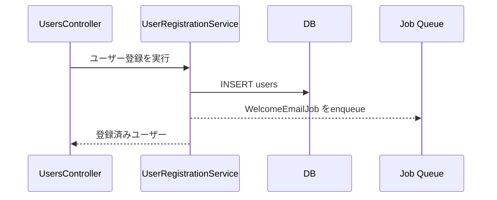
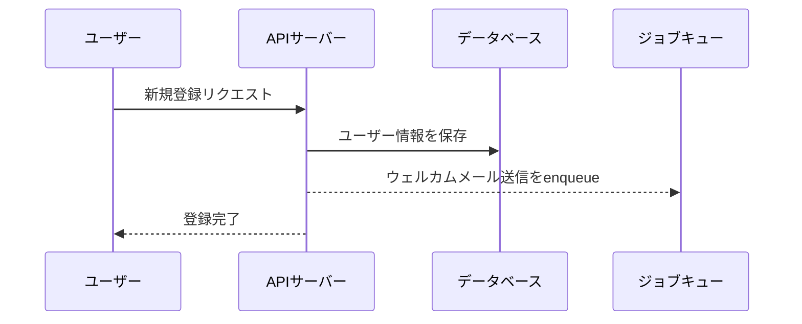

# シーケンス図ジェネレーター

既存コードを解析し、Mermaid形式のシーケンス図を`./tmp`に出力する。用途は**コード理解（自分用）** を想定しており、速さと「骨格が見える」ことを優先する。

---

## ワークフロー

以下の5ステップで進める。途中のステップを飛ばさないこと。各ステップは順序依存がある。

### 1. エントリポイントの特定

ユーザーの依頼文からエントリポイント（トレース開始点）を特定する。

- **依頼文にクラス名・ファイルパス・関数名・ルート・エンドポイントが含まれる場合**: Grepで該当コードを特定し、即トレース開始
- **機能名のみの場合（例: 「ユーザー登録」「決済完了」）**: Grepで候補を検索し、複数見つかったら`AskUserQuestion`で選択肢を提示
- **候補が0件の場合**: ユーザーに「該当コードが見つかりません。ファイル名・クラス名・関数名などを教えてください」と聞き返す
- **トレース方向が曖昧な場合**（例: ジョブクラス名のみ指定されたとき、「enqueue元から辿る？ジョブ内部のみ？」）: `AskUserQuestion`で方向性を確認

### 2. 抽象度の確認

ユーザーに以下2択を提示する。既に依頼文で明示されている場合はスキップしてよい。

- **(a) クラス単位**: participantはコード上のクラス名そのまま。メソッド呼び出しがメッセージ。コード追跡に最適
- **(b) 概念レベル**: participantは抽象化（「ユーザー」「APIサーバー」「データベース」等）。クラス名を出さない。全体像把握に最適

確認には`AskUserQuestion`を使う。

### 3. 呼び出しグラフのトレース（Exploreサブエージェント）

エントリポイントから副作用境界までの呼び出しグラフを、`Explore`サブエージェントに構造化して収集させる。

サブエージェントへの指示書テンプレートは`references/explore-prompt.md`を参照し、以下を差し込んで使う:
- エントリポイントのファイルパスと関数・クラス
- 展開/停止ルール（後述）
- 返却フォーマット（JSON）

メインコンテキストでは直接Grep/Readしない。解析はサブエージェントに任せる（コンテキスト汚染を避け、並行トレースに備える）。

### 4. Mermaid生成

サブエージェントから受け取った構造化データを、選択された抽象度とラベル言語ルールに従ってMermaidに変換する。

- 非同期境界（ジョブのenqueue等）は**別セクション・別`sequenceDiagram`ブロック**として出力
- トランザクション境界は`rect`で囲む
- 主要なエラーハンドリングは`alt`で表現
- 参加者が8個以上または矢印が30本以上になる場合は、**書く前に**ユーザーに相談（分割 / 抽象度変更 / スコープ絞り込みのどれにするか）

### 5. 保存と要約

`./tmp/sequence_<snake_case_slug>.md`に保存する。slugは依頼内容から推定（例: 「ユーザー登録のシーケンス図」→`sequence_user_registration.md`）。既存ファイルは上書き。

保存後、ユーザーに以下を返す:
- ファイルパス
- participant数・メッセージ数
- 主要な分岐・非同期境界の有無
- 省略した要素（ある場合は理由付き）

---

## 展開/停止ルール

トレースの範囲判断は以下に従う。ディレクトリ名はヒントに過ぎず、実装内容が最終判断基準。

### 展開する（participantとして切り出し、内部の呼び出しを描く）

- ビジネスロジック層: `services/`・`use_cases/`・`commands/`・`handlers/`・`interactors/` 配下
- エントリポイント: Controller・API endpoint・GraphQL Resolver/Mutation/Subscription・DataLoader Source・Job/Worker・Event Handler
- モデルでも副作用を持つメソッド（`create!`・`update_xxx!`・複数モデルへの伝播・トランザクションを張る・ジョブを投入する等）

### 展開しない（呼び出し宛先として表示はするが、内部は追わない）

- Pure getter・formatter・scope・validator
- Framework/library標準機能（ORMのクエリメソッド、認証ミドルウェア、ロガー等）
- 1-2行の自明なヘルパー

### 停止点（それ以上潜らない）

- DB操作（`.find`・`.where`・`.create!`・`.update!`・raw SQL）
- 外部HTTP呼び出し（各種HTTPクライアント、gem/SDKによる外部API）
- ジョブ/キューの投入（`perform_later`・`perform_async`・pub/sub publish）
- ネットワーク境界（gRPC・メッセージブローカー等）

### 判定に迷う場合

展開側に倒す（後から削る方が楽）。ただし明らかに純粋関数的なものは展開しない。

---

## 含める要素・省く要素

| 要素 | 方針 |
|---|---|
| DB呼び出し | 主要なクエリのみ含める。`.find`や`.save`など自明なものは省いてよい |
| 認証・認可 | デフォルトで**省く**（フロー本体が見えなくなる）。ユーザーが明示要求した場合のみ含める |
| トランザクション境界 | **含める**。Mermaidの`rect`で囲む |
| ジョブの非同期境界 | **点線矢印＋`Note`で「非同期」と明示**。ジョブ本体は**別のシーケンス図**として同じファイル内に分離 |
| エラーハンドリング | 業務ロジック上重要な分岐のみ`alt`で表現。すべての例外は入れない |
| 外部API | **含める**（副作用の境界として重要） |
| ログ・メトリクス送信 | **省く**（ノイズ） |

---

## 抽象度別のラベル規則

### クラス単位モード (a)

- participant: コード上のクラス名そのまま。必要に応じて短いエイリアス
- メッセージ: **日本語で行為を書く**（メソッド名そのままより意味が読み取れるため）
- DB・外部APIなど境界の向こう側: 概念名（`DB`・`LINE API`等）



### 概念レベルモード (b)

- participant: 抽象的な役割名。すべて日本語
- メッセージ: 日本語
- クラス名は出さない



---

## 出力ファイル構造

`./tmp/sequence_<slug>.md` の中身:

````markdown
# <タイトル（依頼内容から）>

**抽象度**: クラス単位 | 概念レベル
**エントリポイント**: `<ファイルパス>:<行番号>` （該当する場合）
**参照ファイル**:
- `path/to/file1.rb`
- `path/to/file2.rb`

## 同期処理

```mermaid
sequenceDiagram
    ...
```

## 非同期処理: <JobName>

（該当する場合のみ。ジョブごとに節を分ける）

```mermaid
sequenceDiagram
    ...
```

## 補足メモ

（省略した要素・前提・注意点があれば簡潔に）
````

---

## エッジケース

- **候補が複数ある**: `AskUserQuestion`で選択肢を提示。最大5件まで
- **候補が0件**: 「該当コードが見つかりませんでした。ファイル名・クラス名・ルートなどを教えてください」と聞き返す
- **トレースが大規模**: participant 8個または矢印30本を超える見込みなら、図を書く前にユーザーに相談（分割 / 抽象度変更 / スコープ絞り込み）
- **動的ディスパッチで追えない**（コールバック・ポリモーフィズム・メタプログラミング等）: 図中に`Note`で「動的呼び出しのため追跡不可」と明示し、想定される実装を推定で描く場合はその旨を補足メモに書く
- **循環呼び出し**: `loop`ブロックで表現。再帰深度が深い場合は概念的に1回分だけ描いて`Note`で補足

---

## Mermaid記法リファレンス

複雑な記法（`alt`・`loop`・`par`・`critical`・`rect`・`Note`・`activate/deactivate`）は必要に応じて使ってよい。構文検証はスキル内では行わない（ユーザーがIDEのプレビューで確認する前提）。

代表パターンは`references/mermaid-patterns.md`参照。
