# Mermaid シーケンス図 記法リファレンス

シーケンス図生成でよく使う記法パターン集。実装で迷ったらここを参照。

---

## 基本形

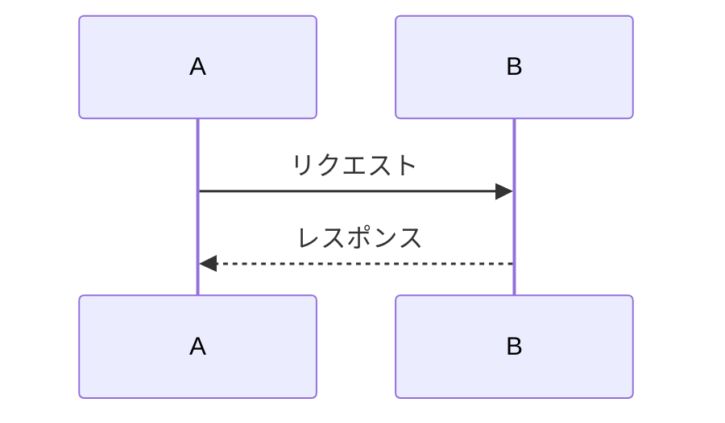

- `->>`: 実線矢印（同期呼び出し）
- `-->>`: 点線矢印（レスポンス・非同期）
- `->x` `-->x`: エラー・失敗
- `participant X as Y`: エイリアス（X が短縮名、Y が表示名）

---

## エイリアス（長いクラス名を短縮）

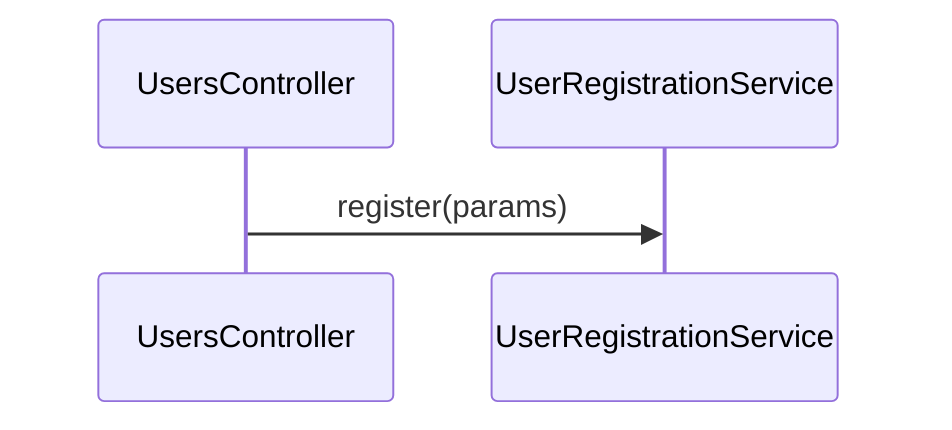

クラス単位モードではクラス名が長くなりやすいため、エイリアスを積極的に使う。

---

## トランザクション境界（rect で囲む）

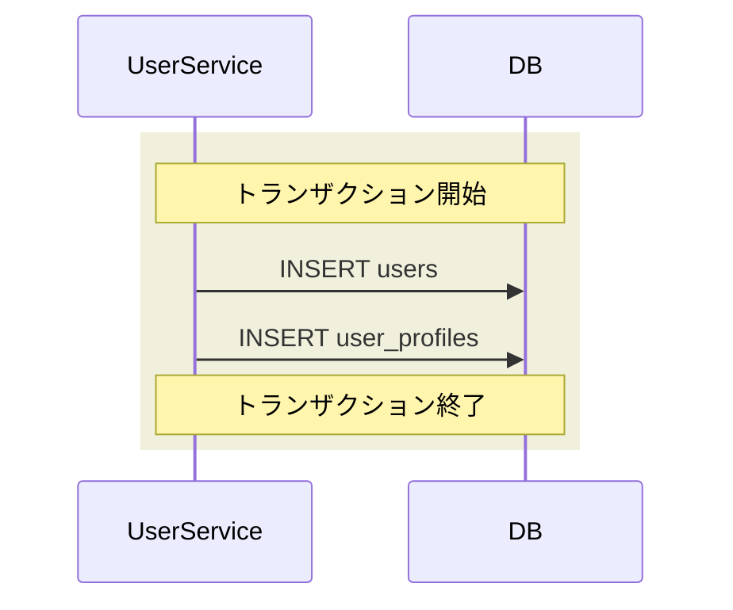

- `rect rgb(...)` で背景色を付けた範囲を作る
- `Note over X,Y: ...` で範囲の意味を明示

---

## 条件分岐（alt / else）

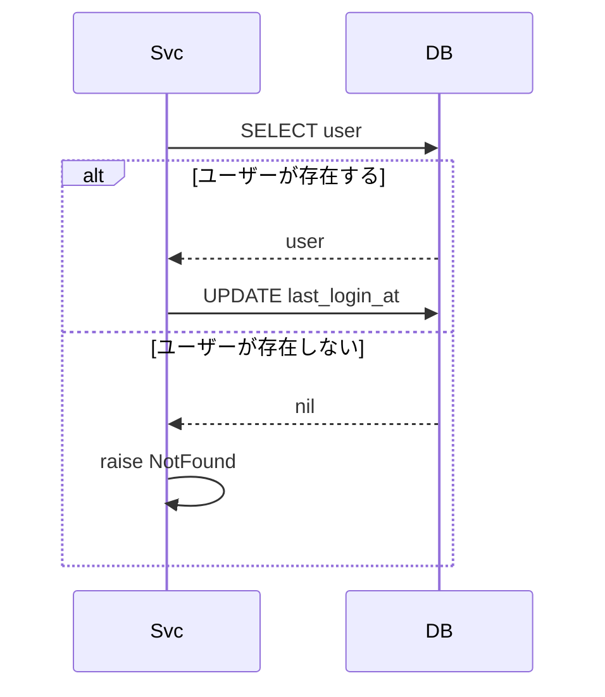

- 重要な業務分岐のみ使う
- 分岐が多いとすぐに読めなくなるので厳選

---

## ループ（loop）

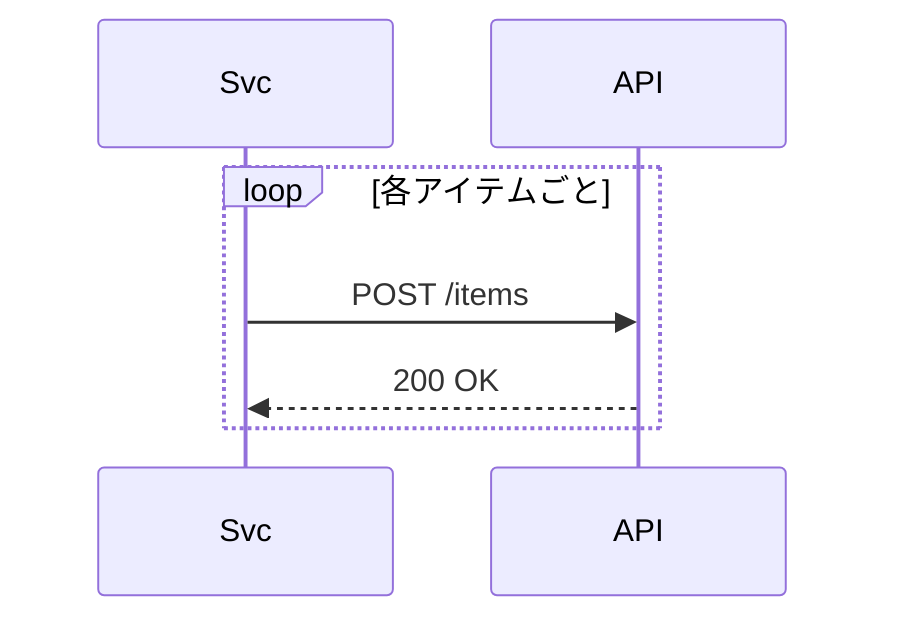

N+1 的な繰り返しや、配列処理を表現するとき。

---

## 並列処理（par）

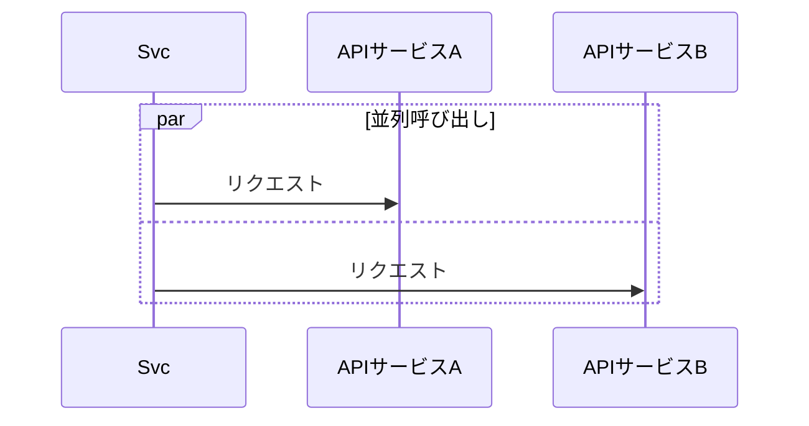

`Promise.all`・`Parallel.each`・`Concurrent::Promises` 等を表現。

---

## オプショナル（opt）

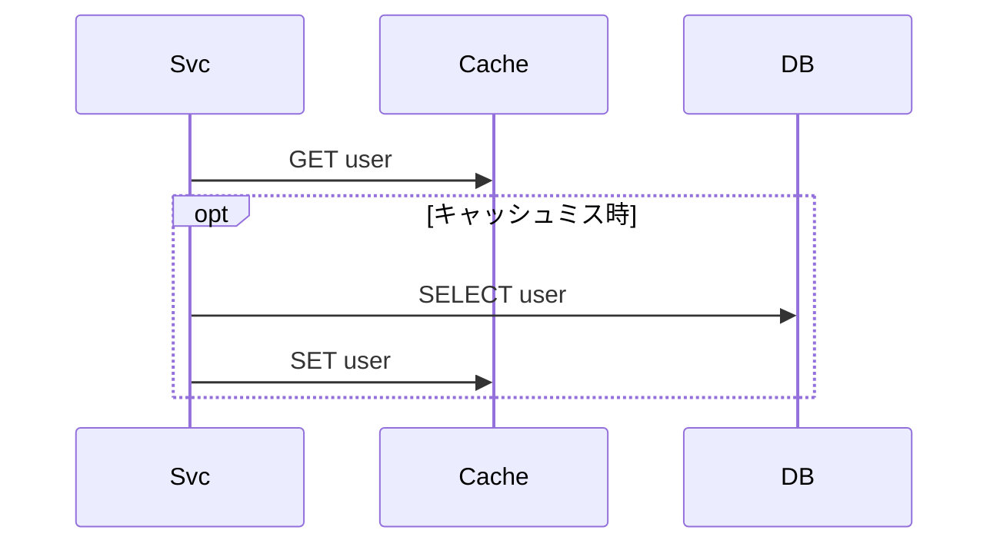

「ある条件下のみ実行」を表現。`alt` の片側だけ必要なときに使う。

---

## 非同期ジョブのenqueue

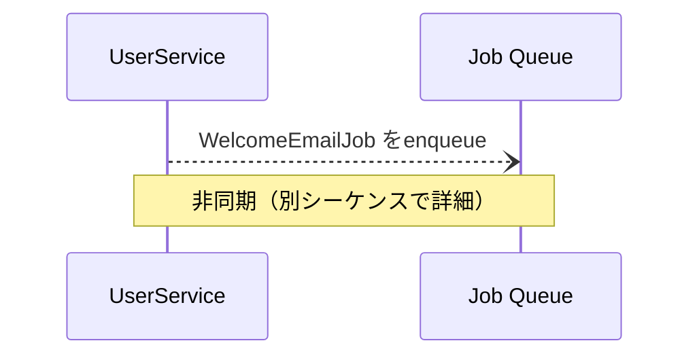

- `--)` は非同期を示す矢印（点線・open arrow）
- `Note over ...` で非同期境界であることを明示
- ジョブ本体は**別の`sequenceDiagram`ブロック**として同じファイル内の別見出しに配置

---

## アクティベーション（オプション・使うと読みやすい場合のみ）

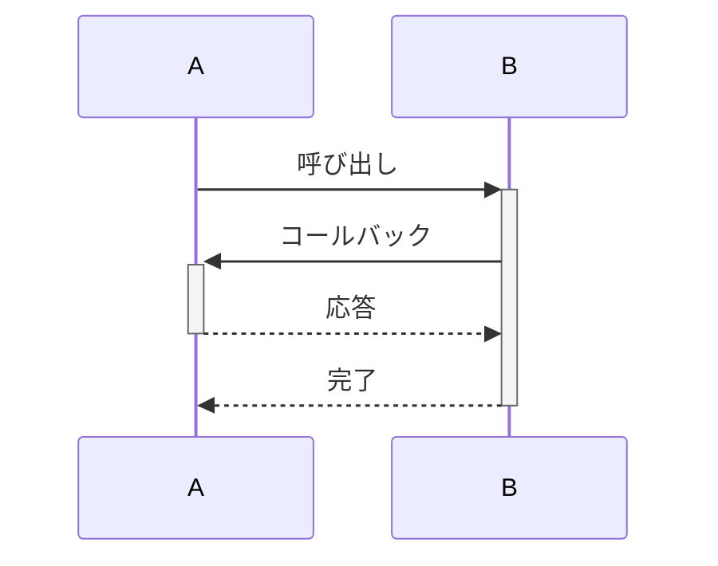

- `->>+` で activate、`-->>-` で deactivate
- ネストした呼び出しや長い処理を視覚化するのに便利
- 使わなくても正しく読めるので、複雑なときのみ追加

---

## Note（補足）

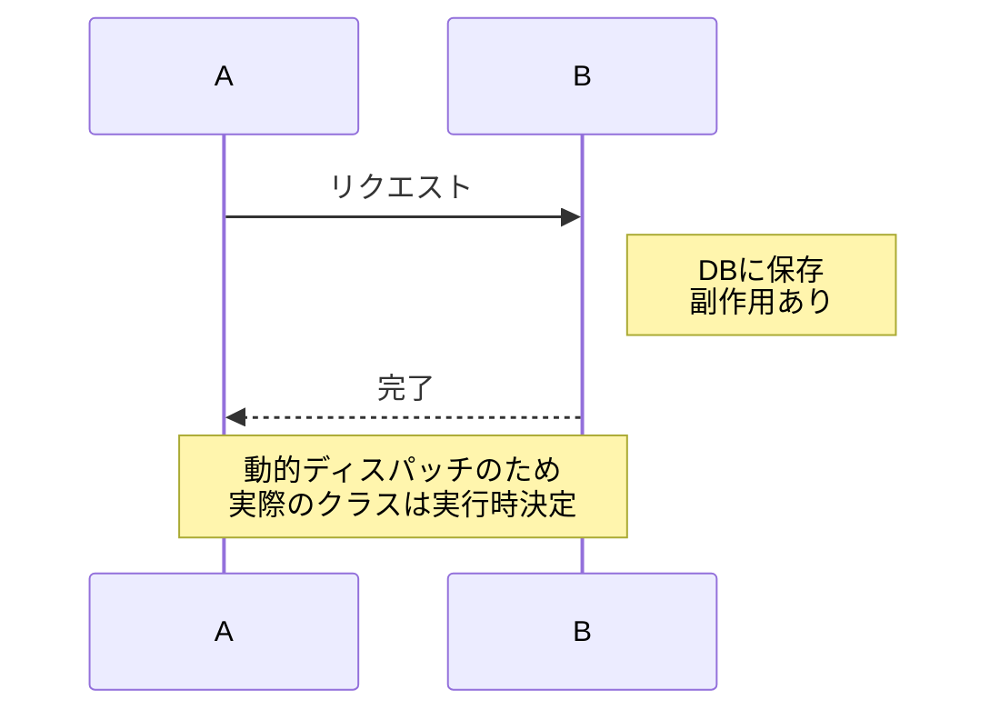

- `Note left of X`・`Note right of X`・`Note over X,Y`
- ` ` で改行
- 動的ディスパッチ・推測部分・前提条件などを補足

---

## Critical（クリティカルセクション・例外伴う）

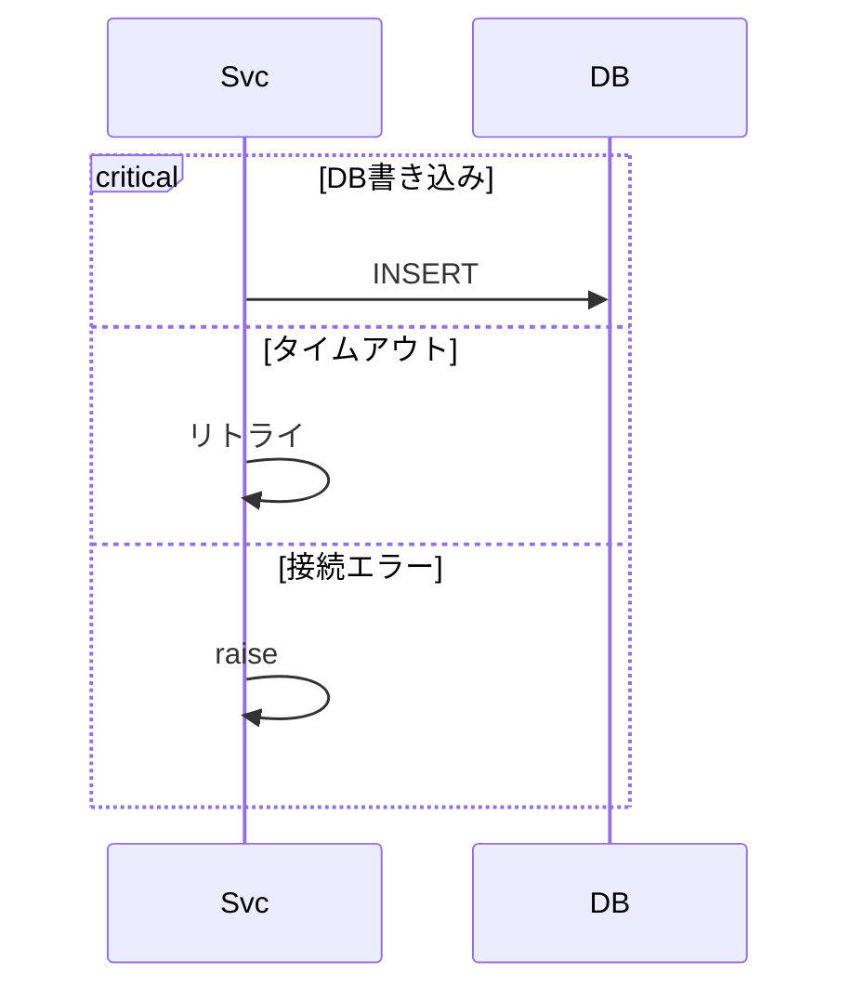

`alt` よりも「障害ハンドリング」の意味が強いときに使う。通常は `alt` で足りる。

---

## Self-call（自己呼び出し）

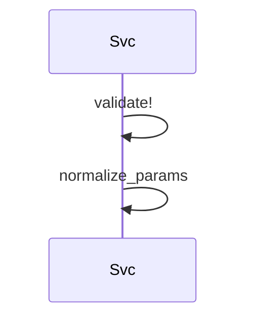

同一クラス内のメソッド呼び出し。展開ルール上で業務ロジックを含むなら記載する。

---

## 使い分けのコツ

- **最初は基本形だけで描いてみる**。読めなかったら `alt`・`loop`・`rect` を足していく
- **アクティベーション（`+`/`-`）は複雑さが増すので、読みやすさが勝るときのみ使う**
- **Note は多用しない**。図本体で意味が通るのが理想。Noteは「描けない事情」を補足する用途
- **色付き rect はトランザクション専用** にしておくと一貫性が出る（他用途に使わない）
