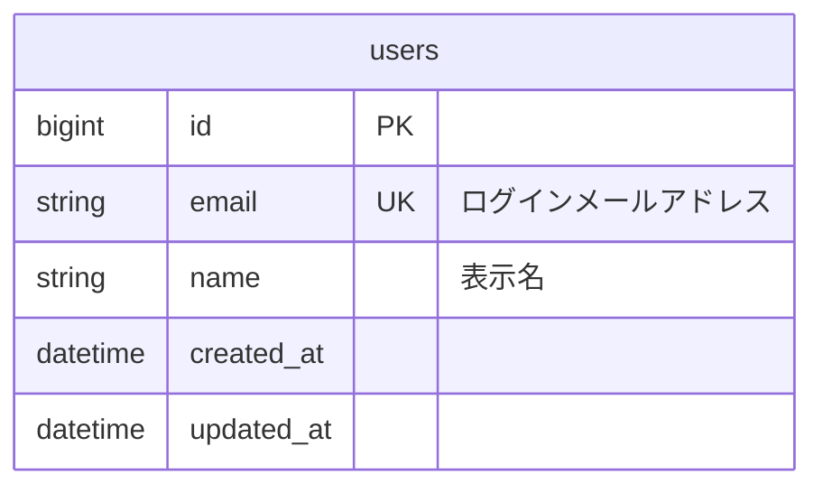
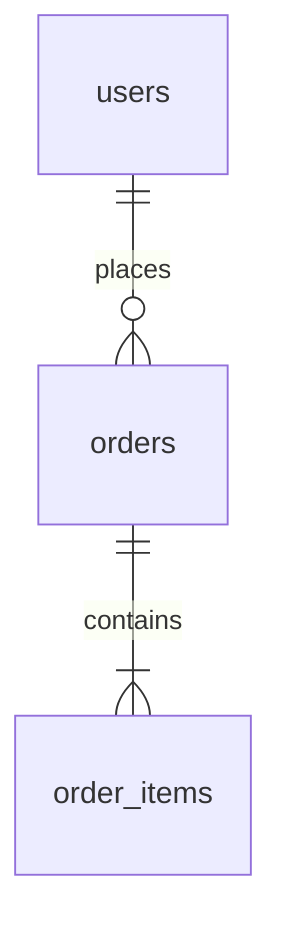
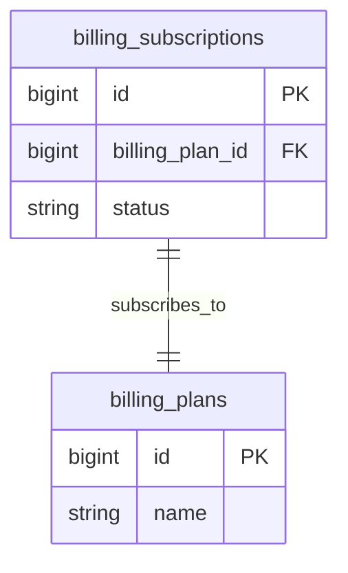
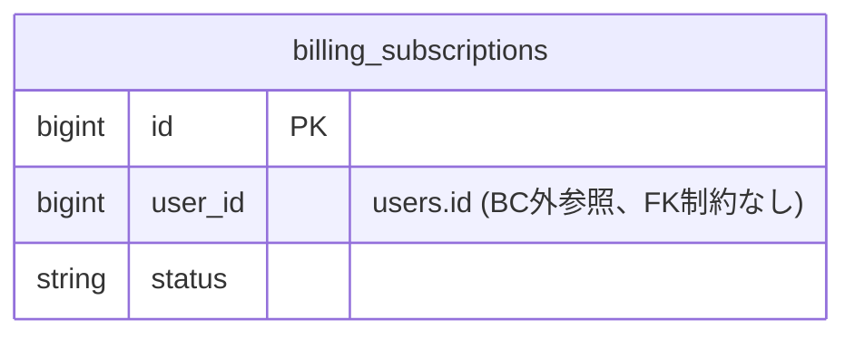
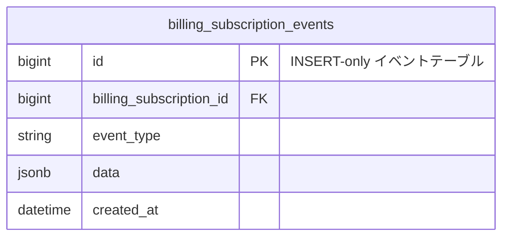
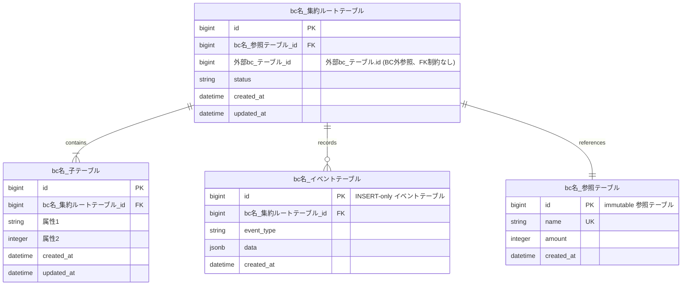
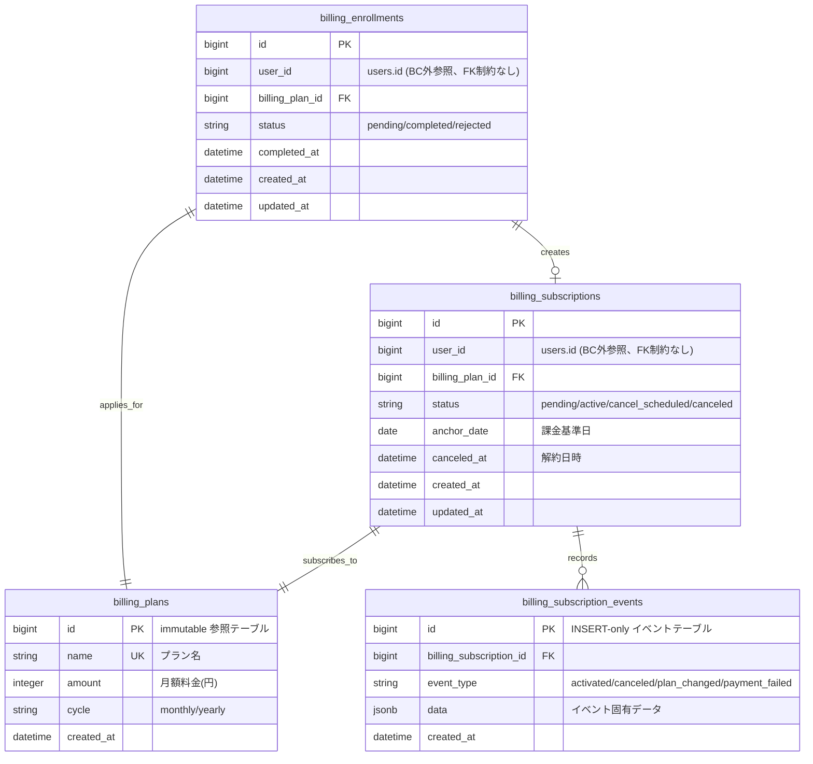

# ER図ガイド（Mermaid erDiagram）

## このドキュメントの目的

conceptual-modelingスキルが出力する概念モデル図（ビジネス用語ベース）を、テーブル設計レベルのER図に変換するためのガイド。

---

## 概念モデル図（classDiagram）との違い

| | 概念モデル図（conceptual-modeling） | ER図（table-design） |
|---|---|---|
| 目的 | 概念と関係の明確化 | テーブル構造の定義 |
| 対象読者 | エンジニア + ビジネス | エンジニア + DBA |
| 言語 | ビジネス用語（日本語） | テーブル名・カラム名（英語） |
| 記法 | Mermaid classDiagram | Mermaid erDiagram |
| 属性 | 概念的属性 | カラム名・型・制約 |
| 関連 | 概念的関係 | FK制約に基づく関連 |

---

## Mermaid erDiagram 記法

### 関連の表現

| 記号 | 意味 | 例 |
|---|---|---|
| `\|\|--o{` | 1対多（必須 → 任意） | `users \|\|--o{ orders` |
| `\|\|--\|{` | 1対多（必須 → 必須） | `orders \|\|--\|{ order_items` |
| `}o--o{` | 多対多 | 中間テーブル経由 |
| `\|\|--\|\|` | 1対1 | `users \|\|--\|\| profiles` |
| `o\|--o{` | 0..1対多 | 任意の親子関係 |

記号の読み方:
- `||` — 必ず1つ（1, exactly one）
- `o|` — 0または1（0..1）
- `|{` — 1つ以上（1..*, at least one）
- `o{` — 0以上（0..*, zero or more）

### カラム定義



**型の表記:**

| 型 | 用途 |
|---|---|
| bigint | 主キー、外部キー |
| integer | 数量等 |
| smallint | 小さな整数値 |
| string | varchar/text（短文） |
| text | 長文テキスト |
| boolean | true/false |
| date | 日付 |
| datetime | 日時 |
| timestamp | タイムスタンプ |
| decimal | 金額等（精度が必要な数値） |
| jsonb | JSON構造 |
| uuid | UUID |

**制約の表記:**

| 制約 | 意味 |
|---|---|
| PK | Primary Key |
| FK | Foreign Key |
| UK | Unique Key |

**コメント:** ダブルクォートで囲む。省略可。ビジネス上の意味を補足する場合に使用する。

### 関連ラベル



ラベルは英語の動詞句で記述する。関連の意味がテーブル名から自明な場合でも必ず付ける。

---

## BC境界の表現

Mermaid erDiagramには`namespace`がないため、テーブル名にBCプレフィックスを付けて表現する。



- `billing_` — Billing BC
- `attendance_` — Attendance BC

### BC間の参照

BC間の参照はFK制約なしのIDカラムとして表現し、コメントで明示する。



BC外参照のカラムにはFKマークを付けない。コメントで参照先テーブルとFK制約なしであることを明記する。

---

## イミュータブルデータモデリングの表現

ER図ではテーブルの更新特性をコメントで明示する。

| 更新特性 | 意味 | コメント表記 |
|---|---|---|
| INSERT-only | 追記のみ、UPDATE/DELETE不可 | `"INSERT-only イベントテーブル"` |
| immutable | 作成後は変更不可 | `"immutable 参照テーブル"` |
| mutable | 通常の更新あり | 表記不要（デフォルト） |

テーブル名の上のコメントではなく、テーブル定義内の最初の行にコメントとして記載する。



---

## テンプレート



---

## サンプル: サブスクリプション機能のER図



### 設計意図

- **billing_plans** — immutableな参照テーブル。プラン変更時は新レコードを作成し、既存のsubscriptionは旧plan_idを保持する。UPDATE/DELETEしない。
- **billing_subscription_events** — INSERT-onlyのイベントテーブル。状態遷移の履歴を全て記録する。`billing_subscriptions.status`はこのイベントから導出可能だが、クエリ性能のため現在状態として保持する。
- **billing_subscriptions** — 現在状態を持つテーブル。eventsの最新状態を反映する。statusカラムはevent_typeと整合する。
- **billing_enrollments** — 申し込みテーブル。申し込み完了時にsubscriptionを作成する。

---

## 概念モデル → ER図の変換手順

### Step 1: 集約ルート・エンティティをテーブルに変換

- クラス名をテーブル名（複数形スネークケース）に変換
- BCプレフィックスを付与
- 概念的な属性をカラム名・型に変換
- `bigint id PK`を追加
- `created_at`, `updated_at`を追加

### Step 2: 値オブジェクトの実装を決定

- 単一値 → カラムとして埋め込み
- 複合値 → 複数カラムとして埋め込み、またはJSONBカラム
- 独立ライフサイクルを持つ → 別テーブル

### Step 3: 関連をFK制約で表現

| 概念モデル | ER図 |
|---|---|
| `A "1" *-- "*" B : 持つ` | `A \|\|--\|{ B : "contains"`（集約内、FK制約あり） |
| `A "1" --> "0..1" B : 参照` | `A \|\|--o\| B : "references"` |
| BC間の参照 | FK制約なしのIDカラム + コメント |

### Step 4: イミュータブル特性を付与

- イベントソーシング的なテーブル → INSERT-only
- マスタデータ・参照テーブル → immutable
- 通常のエンティティ → mutable（表記不要）

### Step 5: インデックスの検討

ER図には直接表現しないが、設計意図セクションで以下を記載する:
- FK制約カラムへのインデックス
- 検索・ソートで使用するカラムへのインデックス
- ユニーク制約（UKで表現済み）

---

## チェックリスト

- [ ] 全テーブルに`bigint id PK`があるか
- [ ] FK制約は集約境界内に限定されているか
- [ ] BC間参照はFK制約なしのIDカラム + コメントで表現されているか
- [ ] 関連のカーディナリティは正確か
- [ ] テーブル名はRails規約に従っているか（複数形スネークケース）
- [ ] BCプレフィックスが付与されているか
- [ ] イミュータブルテーブルがコメントで識別できるか（INSERT-only / immutable）
- [ ] 全ての関連にラベル（英語動詞句）があるか
- [ ] `created_at` / `updated_at`が適切に配置されているか（INSERT-onlyテーブルには`updated_at`不要）
- [ ] BC外参照のカラムにFKマークが付いていないか

---

## よくある間違い

### NG: 概念モデルのまま書く

```
サブスクリプション {
    ステータス
    基準日
}
```

### OK: テーブル設計レベルで書く

```
billing_subscriptions {
    bigint id PK
    string status
    date anchor_date
    datetime created_at
    datetime updated_at
}
```

### NG: BC間参照にFK制約を付ける

```
billing_subscriptions {
    bigint id PK
    bigint user_id FK    ← NG: BC外のテーブルへのFK
}
```

### OK: BC間参照はFK制約なし + コメント

```
billing_subscriptions {
    bigint id PK
    bigint user_id "users.id (BC外参照、FK制約なし)"
}
```

### NG: INSERT-onlyテーブルにupdated_atを付ける

```
billing_subscription_events {
    bigint id PK
    datetime created_at
    datetime updated_at    ← NG: INSERT-onlyなので不要
}
```

### OK: INSERT-onlyテーブルはcreated_atのみ

```
billing_subscription_events {
    bigint id PK "INSERT-only イベントテーブル"
    datetime created_at
}
```

### NG: テーブル名が単数形

```
billing_subscription {    ← NG: 単数形
    bigint id PK
}
```

### OK: テーブル名は複数形

```
billing_subscriptions {
    bigint id PK
}
```
